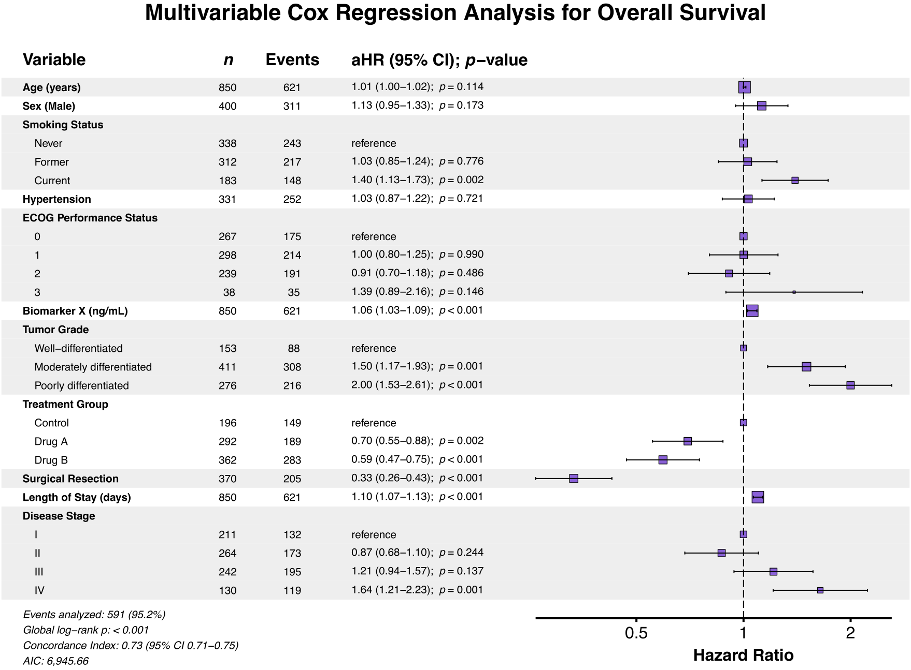

# <span class="pkg-name">summata</span> <a href="https://phmcc.github.io/summata/"></a>

<!-- badges: start -->
[](https://github.com/phmcc/summata/actions/workflows/R-CMD-check.yaml)
[](https://CRAN.R-project.org/package=summata)
[](https://lifecycle.r-lib.org/articles/stages.html#experimental)
<!-- badges: end -->

> ***summata*** | /suːˈmɑːtə/ | *Latin, n. pl. of* summātum*, gerundive of* summāre*: those that have been summarized*
>
> Concise, publication-ready statistical summaries.

## Overview

The `summata` package provides a comprehensive framework for regression analysis. Built on `data.table` for computational efficiency, this package is designed to simplify the path from descriptive analysis, to regression modeling, to publication-ready tables and visualizations—all using a unified input interface with standardized outputs.



## Installation

This package can be installed from GitHub (stable) or Codeberg (development):

```r
# Stable release
devtools::install_github("phmcc/summata")

# Development version
devtools::install_git("https://codeberg.org/phmcc/summata.git")
```

## Theoretical Framework

### Design Principles

The package architecture of `summata` reflects three guiding principles:

1. **Consistent syntax.** All modeling functions share a common signature: data first, followed by the variable of interest, then additional covariates. This convention facilitates both pipe-based workflows and pedagogical clarity.

2. **Transparent computation.** Functions attach their underlying model objects and raw numerical results as attributes, permitting additional verification of computations or extension of analyses beyond the formatted output.
   
3. **Separation of concerns.** Analysis, formatting, and export constitute distinct operations, allowing each stage to be modified independently.

These principles manifest in the standard calling convention:


``` r
result <- fullfit(data, variable, c("covar1", "covar2", ..., "covarN"), ...)

# The formatted table
print(result)

# The underlying model object
model <- attr(result, "model")

# Unformatted numerical results
raw <- attr(result, "raw_data")
```

### Supported Model Classes

The package provides unified handling for the following regression models:

| Model Class | Function | Effect Measure |
|:------------|:---------|:---------------|
| Linear regression | `stats::lm()` | *β* coefficient |
| Logistic regression | `stats::glm()` | Odds ratio |
| Poisson regression | `stats::glm()` | Rate ratio |
| Cox proportional hazards | `survival::coxph()` | Hazard ratio |
| Conditional logistic | `survival::clogit()` | Odds ratio |
| Linear mixed effects | `lme4::lmer()` | *β* coefficient |
| Generalized linear mixed effects | `lme4::glmer()` | Odds/rate ratio |
| Cox mixed effects | `coxme::coxme()` | Hazard ratio |

## Functional Reference

### Primary Analysis Functions

The core analytical functions implement standard regression workflows:

| Function | Purpose |
|:---------|:--------|
| `desctable()` | Descriptive statistics with stratification and hypothesis testing |
| `uniscreen()` | Systematic univariable analysis across multiple predictors |
| `fit()` | Single regression model with formatted coefficient extraction |
| `fullfit()` | Integrated univariable screening and multivariable regression |
| `compfit()` | Nested model comparison with information criteria |
| `multifit()` | Single predictor evaluated against multiple outcomes |

### Export Functions

Tables may be rendered to multiple output formats:

| Function | Format | Dependency |
|:---------|:-------|:-----------|
| `autotable()` | Auto-detect from extension | Varies |
| `table2pdf()` | PDF | LaTeX distribution |
| `table2docx()` | Microsoft Word | officer, flextable |
| `table2pptx()` | Microsoft PowerPoint | officer, flextable |
| `table2tex()` | LaTeX source | xtable |
| `table2html()` | HTML | xtable |
| `table2rtf()` | Rich Text Format | — |

### Visualization Functions

Forest plots are generated directly from model objects or analysis results:

| Function | Application |
|:---------|:------------|
| `autoforest()` | Automatic model class detection |
| `lmforest()` | Linear model coefficients |
| `glmforest()` | Generalized linear model effects |
| `coxforest()` | Proportional hazards estimates |
| `uniforest()` | Univariable screening results |
| `multiforest()` | Multi-outcome analysis results |

## Comparison with Related Packages

The R ecosystem includes several well-established packages for regression table generation. The following abridged comparison identifies areas of overlap and distinction:

| Capability | summata | gtsummary | finalfit | arsenal |
|:-----------|:-------:|:---------:|:--------:|:-------:|
| Descriptive statistics | ✓ | ✓ | ✓ | ✓ |
| Univariable screening | ✓ | ✓ | ✓ | ✓ |
| Multivariable regression | ✓ | ✓ | ✓ | ✓ |
| Multi-format export | ✓ | ✓ | ✓ | ✓ |
| Integrated forest plots | ✓ | ○ | ✓ | — |
| Model comparison | ✓ | ✓ | ○ | — |
| Mixed-effects models | ✓ | ○ | ○ | — |
| Multivariate (multi-outcome) analysis | ✓ | — | — | — |

<sub>✓ Full support | ○ Partial support | — Not available</sub>

A detailed feature comparison is available in the [package documentation](https://phmcc.github.io/summata/articles/feature-comparison.html).

## Illustrative Example

### Step 1 - Data Preparation

The `clintrial` dataset included in this package provides mock clinical trial data, including patient identifiers, baseline characteristics, therapeutic interventions, short-term outcomes, and long-term survival statistics. In a hypothetical analysis of perioperative factors affecting 30-day hospital readmission after treatment, first load the data and specify the variables to be tested:


``` r
library(summata)
library(ggplot2)

# Load example data
data("clintrial")
data("clintrial_labels")

# Organize covariates as a vector
covars_30d <- c("age",
                "sex",
                "race",
                "ethnicity",
                "bmi",
                "smoking",
                "hypertension",
                "diabetes",
                "ecog",
                "creatinine",
                "hemoglobin",
                "biomarker_x",
                "biomarker_y",
                "grade",
                "treatment",
                "surgery",
                "los_days",
                "stage")
```

### Step 2 - Descriptive Statistics

After loading and cleaning the data, use the `desctable()` function to generate summary statistics with stratification by 30-day readmission status:


``` r
# Descriptive statistics table
table1 <- desctable(
    data = clintrial,
    by = "readmission_30d",
    variables = covars_30d,
    labels = clintrial_labels
)

# Export descriptive statistics table to PDF
table2pdf(table1, "table1.pdf",
          caption = "\\textbf{Table 1} - Comparison of baseline characteristics by treatment group",
          paper = "auto",
          caption_size = 10,
          dark_header = TRUE,
          zebra_stripes = TRUE,
          condense_table = TRUE
          )
```

<details>
<summary><strong>Fig 1.</strong> Descriptive statistics table</summary>
<br>

</details>

### Step 3 - Regression Analysis

Once Table 1 has been created, use the `fullfit()` function to implement a complete univariable-to-multivariable regression workflow to determine factors independently predictive of 30-day readmission:


``` r
# Complete regression workflow: univariable + multivariable
results_30d <- fullfit(
    data = clintrial,
    outcome = "readmission_30d",
    predictors = covars_30d,
    method = "screen",        # Auto-select variables based on univariable p-values
    p_threshold = 0.05,       # Include variables with p < 0.05 in multivariable model
    model_type = "glm",
    labels = clintrial_labels
)

# Export regression table to PDF
table2pdf(results_30d, "table2.pdf",
          caption = "\\textbf{Table 2} - Predictors of 30-day readmission, multivariable Cox regression with univariable screen",
          paper = "auto",
          caption_size = 10,
          dark_header = TRUE,
          zebra_stripes = TRUE,
          condense_table = TRUE
)
```

<details>
<summary><strong>Fig 2.</strong> Logistic regression table with univariable screening</summary>
<br>

</details>

### Step 4 - Forest Plot Generation

Finally, create a forest plot of the fitted model to visualize the relative effects of these predictive factors:


``` r
# Fit Cox proportional hazards model
results <- fullfit(
  data = clintrial,
  outcome = "Surv(os_months, os_status)",
  predictors = c("age", "sex", "stage", "grade", "treatment"),
  model_type = "coxph",
  labels = clintrial_labels
)

# Generate forest plot
coxforest(
  x = results,
  title = "Multivariable Cox Regression: Overall Survival"
)
```

<details>
<summary><strong>Fig 3.</strong> Multivariable logistic regression forest plot</summary>
<br>

</details>

## Development

### Repository

- **Primary development**: [codeberg.org/phmcc/summata](https://codeberg.org/phmcc/summata)
- **GitHub mirror**: [github.com/phmcc/summata](https://github.com/phmcc/summata)

### Contributing

Bug reports and feature requests may be submitted via the [issue tracker](https://codeberg.org/phmcc/summata/issues). Contributions are welcome; please consult the contributing guidelines prior to submitting pull requests.

## Acknowledgments

The design of `summata` has been inspired by several existing packages:

- **finalfit** (Harrison) — Regression workflow concepts  
- **gtsummary** (Sjoberg et al.) — Table generation architecture  
- **arsenal** (Heinzen et al.) — Descriptive statistics methodology  
- **data.table** (Dowle & Srinivasan) — High-performance data operations

## License

GPL (≥ 3)

## Citation


``` r
citation("summata")
```

## Further Resources

- **Function documentation**: `?function_name` or the [reference index](https://phmcc.github.io/summata/reference/)
- **Tutorials**: `vignette("summata")` or [online articles](https://phmcc.github.io/summata/articles/)
- **Issue tracker**: [Codeberg Issues](https://codeberg.org/phmcc/summata/issues)

---

<sub>The `summata` package is under active development. The API may be subject to revision prior to CRAN submission.</sub>
