# Performance Benchmarks

Execution speed is rarely the primary consideration when selecting
statistical software—correctness, interpretability, and ease-of-use
usually take precedence. However, computational efficiency becomes
relevant when working with large datasets, conducting simulation
studies, or iterating through model specifications during exploratory
analysis.

This article documents the computational performance of `summata`
relative to established alternatives. The benchmarks presented here are
intended as a reference for users whose workflows involve
performance-sensitive operations, and as a record of the design
tradeoffs inherent in different implementation approaches.

------------------------------------------------------------------------

## Methodology

All benchmarks were conducted using the `microbenchmark` package under
the following conditions:

- **Iterations**: 5–20 per benchmark, adjusted for computational
  intensity
- **Dataset sizes**: 500 to 10,000 observations
- **Data structure**: Simulated clinical trial data with continuous,
  categorical, and time-to-event variables
- **Predictors**: 14 variables for screening benchmarks

Datasets were generated using a fixed random seed to ensure
reproducibility. Timing measurements exclude package loading and data
generation. All packages were tested using default parameters unless
otherwise noted.

Two `summata` configurations are benchmarked throughout: the **default**
configuration, which uses profile likelihood confidence intervals for
GLM models and includes full formatting (QC statistics, sample sizes,
reference rows); and a **minimal** configuration (`summata_minimal`),
which uses Wald CIs and disables optional output features. This
distinction is important because profile likelihood CIs dominate GLM
execution time, and the minimal configuration provides a way to measure
`summata`’s formatting overhead in isolation. Note that `finalfit` and
`broom` also use profile likelihood CIs by default for GLM models.

``` r
library(summata)
library(microbenchmark)
library(ggplot2)
```

------------------------------------------------------------------------

## Descriptive Tables

Descriptive summary tables represent a common first step in data
analysis. The following packages provide comparable functionality with
differing implementation strategies.

| Package | Function | Implementation Notes |
|:---|:---|:---|
| `summata` | [`desctable()`](https://phmcc.github.io/summata/reference/desctable.md) | `data.table` operations |
| `arsenal` | `tableby()` | Formula-based interface |
| `tableone` | `CreateTableOne()` | Matrix-based computation |
| `finalfit` | `summary_factorlist()` | `tidyverse` ecosystem |
| `gtsummary` | `tbl_summary()` | `gt` table framework |

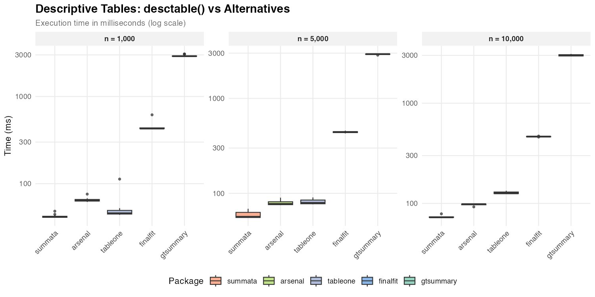

| Dataset Size | `summata` | `arsenal` | `tableone` | `finalfit` | `gtsummary` |
|:-------------|----------:|----------:|-----------:|-----------:|------------:|
| *n* = 1,000  |     42 ms |     64 ms |      46 ms |     429 ms |    2,901 ms |
| *n* = 5,000  |     57 ms |     77 ms |      79 ms |     442 ms |    2,929 ms |
| *n* = 10,000 |     73 ms |     98 ms |     126 ms |     464 ms |    3,001 ms |

The observed timing differences reflect underlying implementation
choices. Packages built on `data.table` or base R matrix operations
(`summata`, `tableone`, `arsenal`) exhibit lower overhead than those
employing more extensive formatting pipelines (`gtsummary`). The
`gtsummary` package prioritizes output flexibility and `gt` integration,
which introduces additional computational cost.

------------------------------------------------------------------------

## Survival Tables

Survival probability tables summarize Kaplan-Meier estimates at
specified time points.

| Package | Function | Notes |
|:---|:---|:---|
| `summata` | [`survtable()`](https://phmcc.github.io/summata/reference/survtable.md) | Formatted output |
| manual | [`survival::survfit()`](https://rdrr.io/pkg/survival/man/survfit.html) | Raw computation |
| `gtsummary` | `tbl_survfit()` | `gt` integration |

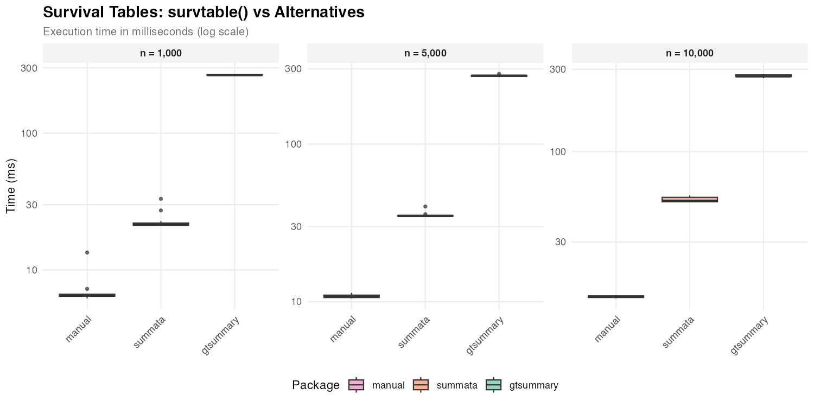

| Dataset Size | `summata` | `gtsummary` | manual |
|:-------------|----------:|------------:|-------:|
| *n* = 1,000  |     21 ms |      266 ms |   6 ms |
| *n* = 5,000  |     35 ms |      271 ms |  11 ms |
| *n* = 10,000 |     52 ms |      274 ms |  14 ms |

Direct [`survfit()`](https://rdrr.io/pkg/survival/man/survfit.html)
computation provides a baseline for the minimum time required. The
difference between raw computation and formatted output reflects the
cost of table construction and presentation logic.

------------------------------------------------------------------------

## Regression Output

The following benchmarks compare functions that extract and format
regression coefficients. Each package produces tables suitable for
publication, though with varying levels of default formatting. Compared
functions are as follows:

| Package | Function | Notes |
|:---|:---|:---|
| `summata` | [`fit()`](https://phmcc.github.io/summata/reference/fit.md) | Profile likelihood CIs, QC stats, counts, and reference rows |
| `summata_minimal` | `fit(..., conf_method = "wald", show_n = FALSE, show_events = FALSE, reference_rows = FALSE, keep_qc_stats = FALSE)` | Wald CIs, reduced output |
| `finalfit` | `glmuni()` + `fit2df()` | Profile likelihood CIs (default) |
| `broom` | `tidy()` | Profile likelihood CIs via [`confint()`](https://rdrr.io/r/stats/confint.html) dispatch |
| `gtsummary` | `tbl_regression()` | `gt` formatting |

### Logistic Regression

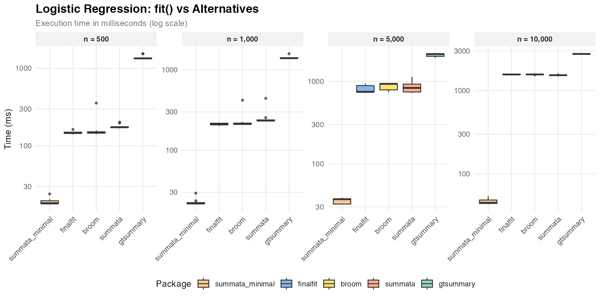

| Dataset Size | `summata_minimal` | `summata` | `finalfit` |  `broom` | `gtsummary` |
|:-------------|------------------:|----------:|-----------:|---------:|------------:|
| *n* = 500    |             18 ms |    174 ms |     147 ms |   150 ms |    1,344 ms |
| *n* = 1,000  |             22 ms |    234 ms |     212 ms |   214 ms |    1,399 ms |
| *n* = 5,000  |             37 ms |    840 ms |     749 ms |   936 ms |    2,153 ms |
| *n* = 10,000 |             45 ms |  1,532 ms |   1,562 ms | 1,564 ms |    2,756 ms |

The default `summata` configuration uses profile likelihood confidence
intervals for GLM models, as do `finalfit` and
[`broom::tidy()`](https://generics.r-lib.org/reference/tidy.html). The
three packages show comparable performance for logistic regression
because profile likelihood profiling dominates execution time for all of
them. The `summata_minimal` configuration uses Wald CIs instead,
skipping the profiling step entirely, and achieves the fastest
extraction times at all sample sizes. At large *n*, profiling cost grows
with the number of IRLS iterations, causing all profile-based packages
to converge toward similar timings.

### Linear Regression

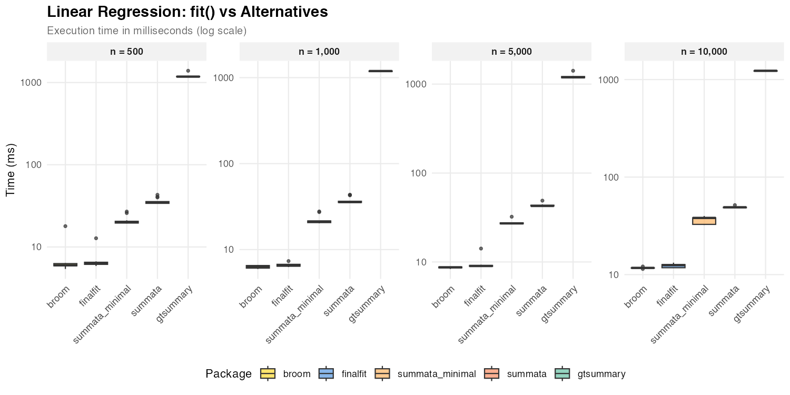

| Dataset Size | `summata_minimal` | `summata` | `finalfit` | `broom` | `gtsummary` |
|:-------------|------------------:|----------:|-----------:|--------:|------------:|
| *n* = 500    |             20 ms |     35 ms |       6 ms |    6 ms |    1,179 ms |
| *n* = 1,000  |             21 ms |     36 ms |       7 ms |    6 ms |    1,193 ms |
| *n* = 5,000  |             27 ms |     43 ms |       9 ms |    9 ms |    1,192 ms |
| *n* = 10,000 |             38 ms |     49 ms |      13 ms |   12 ms |    1,230 ms |

For linear models,
[`broom::tidy()`](https://generics.r-lib.org/reference/tidy.html) and
`finalfit` achieve faster coefficient extraction due to lower formatting
overhead. All three packages use exact *t*-distribution CIs for `lm`
objects (via [`confint.lm()`](https://rdrr.io/r/stats/confint.html)), so
the timing difference reflects formatting features (reference rows, QC
statistics) rather than CI computation.

### Poisson Regression

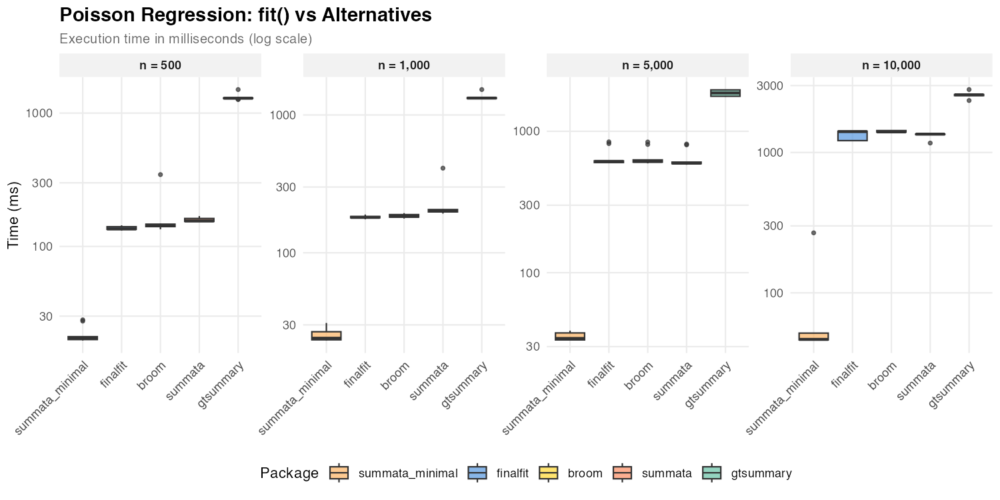

| Dataset Size | `summata_minimal` | `summata` | `finalfit` |  `broom` | `gtsummary` |
|:-------------|------------------:|----------:|-----------:|---------:|------------:|
| *n* = 500    |             20 ms |    155 ms |     135 ms |   144 ms |    1,293 ms |
| *n* = 1,000  |             24 ms |    201 ms |     181 ms |   184 ms |    1,325 ms |
| *n* = 5,000  |             34 ms |    595 ms |     613 ms |   612 ms |    1,868 ms |
| *n* = 10,000 |             47 ms |  1,351 ms |   1,409 ms | 1,402 ms |    2,577 ms |

Poisson regression shows the same profile likelihood pattern as logistic
regression: the default `summata`, `finalfit`, and `broom` all use
profile CIs and show comparable performance. The `summata_minimal`
configuration with Wald CIs is consistently the fastest option.

### Cox Regression

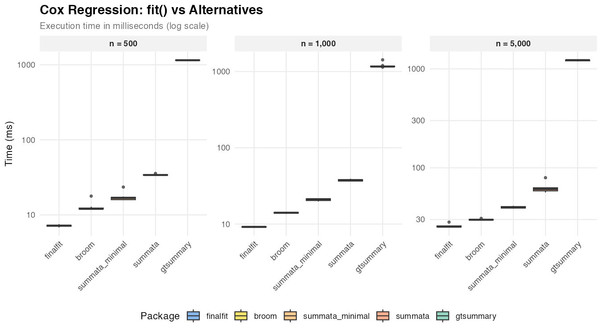

| Dataset Size | summata_minimal | summata | finalfit | broom | gtsummary |
|:-------------|----------------:|--------:|---------:|------:|----------:|
| *n* = 500    |           17 ms |   34 ms |     7 ms | 12 ms |  1,149 ms |
| *n* = 1,000  |           21 ms |   38 ms |     9 ms | 14 ms |  1,161 ms |
| *n* = 5,000  |           40 ms |   61 ms |    25 ms | 30 ms |  1,227 ms |

Cox models use Wald CIs regardless of the `conf_method` setting (the
standard approach in survival analysis), so the timing difference
between `summata` and `summata_minimal` reflects formatting overhead
only. `finalfit` and `broom` achieve faster extraction with less
formatting.

------------------------------------------------------------------------

## Mixed-Effects Models

Mixed-effects models present a useful comparison case because the
underlying model fitting (via `lme4`) dominates execution time
regardless of the wrapper package.

| Package | Function | Notes |
|:---|:---|:---|
| `summata` | `fit(..., model_type = "lmer")` | Unified interface |
| `summata_minimal` | `fit(..., model_type = "lmer", conf_method = "wald", show_n = FALSE, show_events = FALSE, reference_rows = FALSE, keep_qc_stats = FALSE)` | Reduced output |
| `finalfit` | `lmmixed()` + `fit2df()` | Two-step process |
| `broom.mixed` | `tidy()` | Minimal extraction |
| `gtsummary` | `tbl_regression()` | gt formatting |

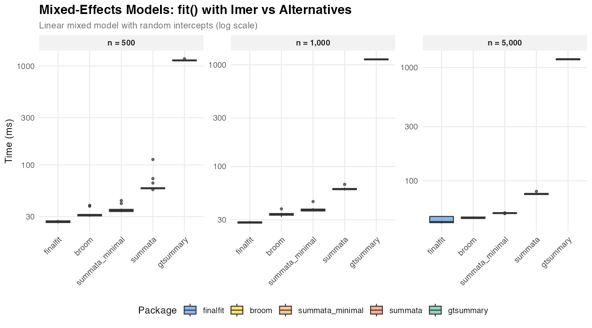

| Dataset Size | `summata_minimal` | `summata` | `finalfit` | `broom` | `gtsummary` |
|:-------------|------------------:|----------:|-----------:|--------:|------------:|
| *n* = 500    |             35 ms |     58 ms |      26 ms |   31 ms |    1,141 ms |
| *n* = 1,000  |             37 ms |     60 ms |      28 ms |   34 ms |    1,133 ms |
| *n* = 5,000  |             52 ms |     76 ms |      43 ms |   47 ms |    1,185 ms |

The relatively narrow spread among `summata`, `finalfit`, and `broom`
reflects the dominance of model fitting time. Differences in wrapper
overhead become proportionally less significant as the underlying
computation grows.

------------------------------------------------------------------------

## Univariable Screening

Univariable screening—fitting separate models for each
predictor—provides a test case for operations involving many repeated
model fits.

| Package | Function | Notes |
|:---|:---|:---|
| `summata` | [`uniscreen()`](https://phmcc.github.io/summata/reference/uniscreen.md) | Parallel-capable |
| `summata_minimal` | `uniscreen(..., conf_method = "wald", show_n = FALSE, show_events = FALSE, reference_rows = FALSE)` | Wald CIs, reduced output |
| `finalfit` | `glmuni()` + `fit2df()` | Sequential |
| `broom` | Loop + `tidy()` | Manual implementation |
| `arsenal` | `modelsum()` | Formula interface |
| `gtsummary` | `tbl_uvregression()` | gt formatting |

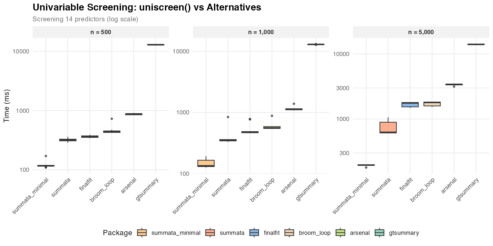

Screening 14 predictors:

| Dataset Size | `summata_minimal` | `summata` | `finalfit` | `broom` | `arsenal` | `gtsummary` |
|:---|---:|---:|---:|---:|---:|---:|
| *n* = 500 | 117 ms | 319 ms | 360 ms | 440 ms | 877 ms | 12,963 ms |
| *n* = 1,000 | 134 ms | 351 ms | 477 ms | 558 ms | 1,128 ms | 13,025 ms |
| *n* = 5,000 | 196 ms | 624 ms | 1,763 ms | 1,799 ms | 3,401 ms | 14,001 ms |

The performance gap between `summata` (default) and `summata_minimal` is
amplified during univariable screening because profile likelihood
profiling is repeated for each of the 14 predictor models. All
profile-based packages (`summata` default, `finalfit`, `broom`) show
comparable performance, as profiling dominates their execution time.
With Wald CIs, `summata_minimal` is the fastest option at all sample
sizes, outperforming the next-fastest alternative by 2.6–9.0× due to
`data.table` vectorization and parallel model fitting.

------------------------------------------------------------------------

## Complete Workflow

The combined univariable screening and multivariable modeling workflow
represents a common analytical pattern in statistical research.

| Package | Approach | Notes |
|:---|:---|:---|
| `summata` | [`fullfit()`](https://phmcc.github.io/summata/reference/fullfit.md) | Single function |
| `summata_minimal` | `fullfit(..., conf_method = "wald", show_n = FALSE, show_events = FALSE, reference_rows = FALSE)` | Wald CIs, reduced output |
| `finalfit` | `finalfit()` | Single function |
| manual | Loop + [`glm()`](https://rdrr.io/r/stats/glm.html) + [`broom::tidy()`](https://generics.r-lib.org/reference/tidy.html) + [`rbind()`](https://rdrr.io/r/base/cbind.html) | Custom |
| `gtsummary` | `tbl_uvregression()` + `tbl_regression()` + `tbl_merge()` | Multi-step |

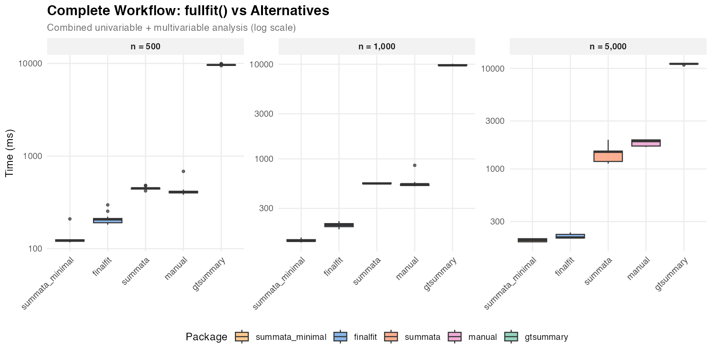

| Dataset Size | `summata_minimal` | `summata` | `finalfit` |   manual | `gtsummary` |
|:-------------|------------------:|----------:|-----------:|---------:|------------:|
| *n* = 500    |            123 ms |    450 ms |     207 ms |   407 ms |    9,655 ms |
| *n* = 1,000  |            136 ms |    549 ms |     200 ms |   541 ms |    9,726 ms |
| *n* = 5,000  |            196 ms |  1,479 ms |     209 ms | 1,889 ms |   11,092 ms |

The default `summata` and `finalfit` show comparable performance for GLM
workflows because both use profile likelihood CIs. The difference
between them reflects `summata`’s additional features (QC statistics,
reference rows, complete-case sample sizes) versus `finalfit`’s
inclusion of a descriptive statistics table. The `summata_minimal`
configuration with Wald CIs is the fastest single-function option at
small to moderate sample sizes, completing the combined analysis in
roughly 60–70% of the time `finalfit` requires at *n* = 500–1,000.

------------------------------------------------------------------------

## Forest Plots

Forest plot generation combines data extraction with graphical
rendering.

| Package | Function | Notes |
|:---|:---|:---|
| `summata` | [`coxforest()`](https://phmcc.github.io/summata/reference/coxforest.md) | Integrated table and plot |
| `survminer` | `ggforest()` | Survival-focused |
| manual | Custom `ggplot2` | Maximum flexibility |

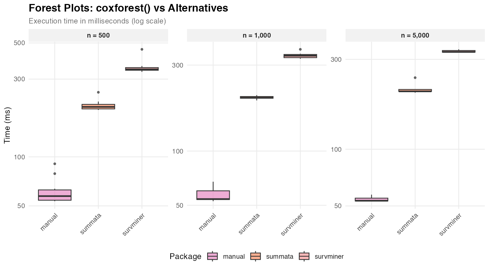

| Dataset Size | `summata` | `survminer` | manual |
|:-------------|----------:|------------:|-------:|
| *n* = 500    |    203 ms |      345 ms |  57 ms |
| *n* = 1,000  |    198 ms |      338 ms |  54 ms |
| *n* = 5,000  |    203 ms |      329 ms |  53 ms |

The manual approach produces only the graphical element, while `summata`
and `survminer` generate integrated displays with coefficient tables.
The relatively constant timing across dataset sizes indicates that plot
rendering, rather than data processing, dominates execution time. Also,
there are significant cosmetic differences between the three graphical
outputs, which predominates other factors when selecting a plotting
function.

------------------------------------------------------------------------

## Relative Performance

The following figures summarize timing ratios across benchmarks. Values
greater than 1 indicate the comparison package requires more time than
the baseline.

### Relative to `summata` (default, profile likelihood CIs)

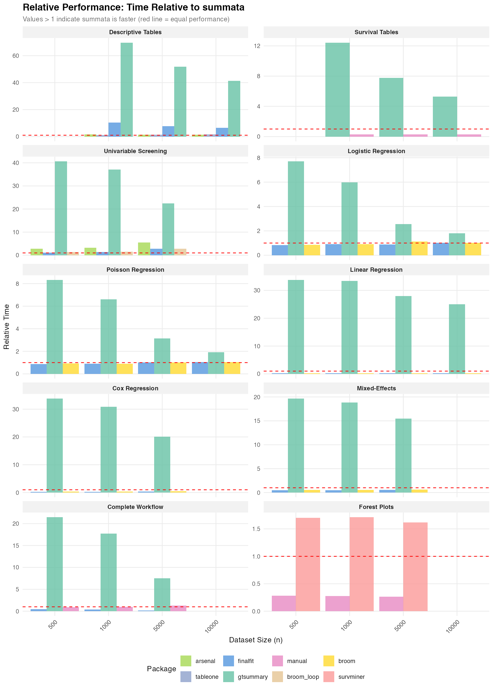

### Relative to `summata_minimal` (Wald CIs, no QC stats)

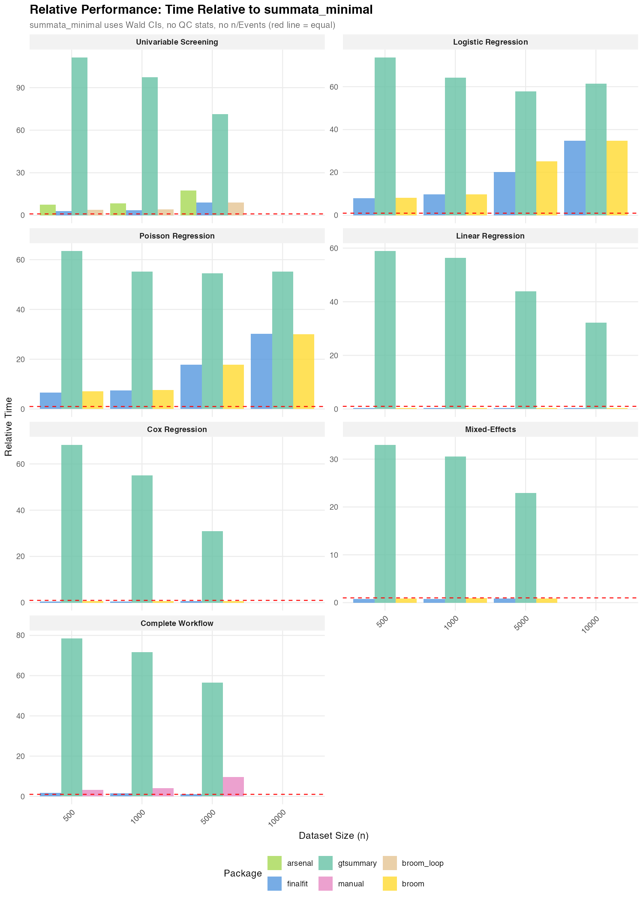

### Summary of Ratios

Ratios relative to `summata` (default):

| Benchmark             | `gtsummary` | `finalfit` | `arsenal` |
|:----------------------|------------:|-----------:|----------:|
| Descriptive Tables    |      41–70× |      6–10× |  1.4–1.5× |
| Survival Tables       |       5–12× |          — |         — |
| Logistic Regression   |        6–8× |   0.8–1.0× |         — |
| Poisson Regression    |        7–8× |   0.9–1.0× |         — |
| Linear Regression     |      25–34× |   0.2–0.3× |         — |
| Cox Regression        |      20–34× |   0.2–0.4× |         — |
| Mixed-Effects         |      16–20× |   0.5–0.6× |         — |
| Univariable Screening |      22–41× |   1.1–2.8× |  2.8–5.5× |
| Complete Workflow     |       8–21× |   0.1–0.5× |         — |

Ratios relative to `summata_minimal` (Wald CIs):

| Benchmark             | `gtsummary` | `finalfit` | `summata` (default) |
|:----------------------|------------:|-----------:|--------------------:|
| Logistic Regression   |      58–74× |      8–35× |              10–34× |
| Poisson Regression    |      55–63× |      7–30× |               8–29× |
| Linear Regression     |      32–59× |       0.3× |            1.3–1.7× |
| Cox Regression        |      31–68× |   0.4–0.6× |            1.5–2.0× |
| Mixed-Effects         |      23–33× |   0.8–0.9× |            1.5–1.7× |
| Univariable Screening |     71–111× |   3.1–9.0× |            2.6–3.2× |
| Complete Workflow     |      57–78× |   1.1–1.7× |            3.7–7.5× |

For GLM models (logistic and Poisson), `summata_minimal` outperforms all
alternatives by a wide margin: 8–35× faster than `finalfit`, 7–30×
faster than `broom`. This is because `summata_minimal` is the only
configuration that uses Wald CIs — `finalfit`, `broom`, and the default
`summata` all use profile likelihood CIs, which accounts for their
comparable timings.

For linear, Cox, and mixed-effects models, where all packages use the
same CI method (exact *t*-distribution for lm, Wald for Cox and
mixed-effects), the timing gap between `summata` and `summata_minimal`
is narrow (1.3–2.0×) and reflects formatting overhead only.

------------------------------------------------------------------------

## Scaling Characteristics

The relationship between dataset size and execution time provides
insight into algorithmic complexity. Near-linear scaling (execution time
proportional to *n*) indicates efficient implementation, while
superlinear scaling may suggest operations with *O*(*n*²) complexity,
such as repeated [`rbind()`](https://rdrr.io/r/base/cbind.html) calls or
element-wise data frame construction.

Observed scaling factors for `summata` (ratio of time at *n* = 10,000 to
time at *n* = 1,000):

| Operation             | Scaling Factor | Expected for *O*(*n*) |
|:----------------------|---------------:|----------------------:|
| Descriptive tables    |           1.7× |                   10× |
| Logistic regression   |           6.5× |                   10× |
| Univariable screening |           1.8× |                   10× |

The sublinear scaling reflects that fixed overhead (package loading,
object construction, profile likelihood profiling) constitutes a
significant fraction of total time at smaller dataset sizes. Logistic
regression shows nearer-to-linear scaling because profile likelihood
profiling cost scales with the number of IRLS iterations, which grows
with *n*.

------------------------------------------------------------------------

## Implementation Notes

The performance characteristics documented here reflect specific
implementation choices:

**summata**: Built on `data.table` for data manipulation, with
coefficient extraction optimized for common model classes. Default
configuration uses profile likelihood CIs for GLM/negbin models
(matching `finalfit` and `broom`). The `conf_method = "wald"` option
skips profiling entirely, producing a configuration faster than any
alternative tested.

**gtsummary**: Prioritizes output flexibility through the `gt` table
framework. The additional abstraction layers enable extensive
customization but increase computational overhead.

**finalfit**: Balances functionality and performance with a
tidyverse-compatible interface. Uses profile likelihood CIs by default
for GLM models (`confint_type = "profile"`). The `finalfit()` function
is particularly optimized for the combined workflow.

**arsenal**: Uses formula-based syntax familiar to SAS users.
Performance varies by operation type.

**broom**: Provides minimal coefficient extraction with limited
formatting. Uses profile likelihood CIs for GLM models via
[`stats::confint()`](https://rdrr.io/r/stats/confint.html) dispatch.
Suitable as a building block for custom pipelines.

------------------------------------------------------------------------

## Effect of Output Options

By default, `summata` regression functions compute profile likelihood
confidence intervals (for GLM and negative binomial models), sample
sizes, event counts, QC statistics, and reference rows for categorical
variables. These features produce more complete and accurate output for
publication but add computational overhead. For performance-sensitive
applications, these options can be disabled.

The `summata_minimal` configuration shown in the benchmarks represents:

``` r
fit(data, outcome, predictors, 
    conf_method = "wald",
    show_n = FALSE, 
    show_events = FALSE, 
    reference_rows = FALSE,
    keep_qc_stats = FALSE)
```

The `conf_method` parameter can also be set globally for an entire
session:

``` r
options(summata.conf_method = "wald")
```

The impact of each option varies by model type:

| Option | GLM/negbin models | Linear/Cox/mixed models |
|:---|:---|:---|
| `conf_method = "wald"` | Large effect (eliminates profile likelihood profiling) | Minimal effect (Wald already used for Cox/mixed; exact *t* is fast for lm) |
| `keep_qc_stats = FALSE` | Moderate effect (skips C-statistic, Hosmer-Lemeshow) | Small effect |
| `show_n/show_events = FALSE` | Small effect | Small effect |
| `reference_rows = FALSE` | Small effect | Small effect |

For logistic and Poisson models at *n* = 1,000, the minimal
configuration is approximately 10× faster than the default (22 ms
vs. 234 ms for logistic), with the majority of the difference
attributable to `conf_method`. For linear and Cox models, the difference
is roughly 1.5–2×, reflecting formatting overhead only.

The choice between configurations depends on the use case:

- **Publication tables**: Default settings provide profile likelihood
  CIs and complete output ready for manuscripts
- **Simulation studies**: `conf_method = "wald"` reduces per-iteration
  overhead substantially for GLM models
- **Exploratory analysis**: Either setting is appropriate;
  `conf_method = "wald"` is recommended when iterating through many
  model specifications

------------------------------------------------------------------------

## Practical Considerations

The timing differences documented here range from negligible (tens of
milliseconds) to substantial (several seconds). The practical
significance depends on context:

- **Interactive analysis**: Differences under 500 ms are generally
  imperceptible
- **Batch processing**: Cumulative differences matter when processing
  many datasets
- **Simulation studies**: Per-iteration overhead compounds across
  thousands of replicates
- **Teaching and demonstration**: Faster feedback loops improve the
  interactive experience

Package selection should primarily reflect functional requirements,
syntax preferences, and ecosystem compatibility. Performance
considerations become relevant only when computational constraints are
binding.

------------------------------------------------------------------------

## Reproducibility

The benchmark script is available in the package repository at
`inst/benchmarks/benchmarks.R`. Execution produces:

- Individual PNG figures for each benchmark category
- Summary figures (`benchmark_speedup.png`,
  `benchmark_speedup_minimal.png`)
- CSV files with detailed timing data

Results will vary across systems due to differences in hardware, R
version, and package versions.

------------------------------------------------------------------------

## Session Information

This benchmark was run under the following conditions:

    R version 4.5.2 (2025-10-31)
    Platform: x86_64-unknown-linux-gnu

    Matrix products: default
    BLAS/LAPACK: /usr/lib/libopenblasp-r0.3.30.so;  LAPACK version 3.12.0

    Void Linux x86_64
    Linux 6.12.63_1
    Intel(R) Core(TM) i5-4670K (4) @ 3.80 GHz
    NVIDIA GeForce GTX 970 [Discrete]
