# Forest Plots

Forest plots provide a graphical representation of effect estimates and
their precision. Each row displays a point estimate (typically an odds
ratio, hazard ratio, or regression coefficient) with a confidence
interval, enabling rapid visual assessment of effect magnitude,
direction, and statistical significance. The format is standard in
published research and regulatory submissions.

The `summata` package provides specialized forest plot functions for
each model type, plus an automatic detection function:

| Function | Model Type | Effect Measure |
|:---|:---|:---|
| [`lmforest()`](https://phmcc.codeberg.page/summata/reference/lmforest.md) | Linear regression | Coefficient (*β*) |
| [`glmforest()`](https://phmcc.codeberg.page/summata/reference/glmforest.md) | Logistic/Poisson | Odds ratio / Rate ratio |
| [`coxforest()`](https://phmcc.codeberg.page/summata/reference/coxforest.md) | Cox regression | Hazard ratio |
| [`uniforest()`](https://phmcc.codeberg.page/summata/reference/uniforest.md) | Univariable screening | Model-dependent |
| [`multiforest()`](https://phmcc.codeberg.page/summata/reference/multiforest.md) | Multi-outcome analysis | Model-dependent |
| [`autoforest()`](https://phmcc.codeberg.page/summata/reference/autoforest.md) | Auto-detect | Auto-detect |

These functions follow a standard syntax when called:

``` r
forest_plot <- autoforest(x, data, ...)
```

where `x` is either a model or a `summata` fitted output (e.g., from
[`uniscreen()`](https://phmcc.codeberg.page/summata/reference/uniscreen.md),
[`fit()`](https://phmcc.codeberg.page/summata/reference/fit.md),
[`fullfit()`](https://phmcc.codeberg.page/summata/reference/fullfit.md),
or
[`multifit()`](https://phmcc.codeberg.page/summata/reference/multifit.md)),
and `data` is the name of the dataset used. The `data` argument is
optional and is primarily used to derive *n* and Events counts for
various groups/subgroups.

All forest plot functions produce `ggplot2` objects that can be further
customized. This vignette demonstrates the various capabilities of these
functions using the included sample dataset.

------------------------------------------------------------------------

## Preliminaries

The examples in this vignette use the `clintrial` dataset included with
`summata`:

``` r
library(summata)
library(survival)
library(ggplot2)

data(clintrial)
data(clintrial_labels)
```

> *n.b.:* To ensure correct font rendering and figure sizing, the forest
> plots below are displayed using a helper function (`queue_plot()`)
> that applies each plot’s recommended dimensions (stored in the
> `"rec_dims"` attribute) via the [`ragg`](https://ragg.r-lib.org/)
> graphics device. In practice, replace `queue_plot()` with
> [`ggplot2::ggsave()`](https://ggplot2.tidyverse.org/reference/ggsave.html)
> using recommended plot dimensions for equivalent results:
>
> ``` r
> p <- glmforest(model, data = mydata)
> dims <- attr(p, "rec_dims")
> ggplot2::ggsave("forest_plot.png", p,
>                 width = dims$width, 
>                 height = dims$height)
> ```
>
> This ensures that the figure size is always large enough to
> accommodate the constituent plot text and graphics, and it is
> generally the preferred method for saving forest plot outputs in
> `summata`.

------------------------------------------------------------------------

## Creating Forest Plots from Model Objects

Forest plots can be created from standard R model objects or from
`summata` function output.

### **Example 1:** Logistic Regression

Fit a model using base R, then create a forest plot:

``` r
logistic_model <- glm(
  surgery ~ age + sex + stage + treatment + ecog,
  data = clintrial,
  family = binomial
)

example1 <- glmforest(
  x = logistic_model,
  data = clintrial,
  title = "Logistic Regression: Predictors of Outcome",
  labels = clintrial_labels
)
queue_plot(example1)
```

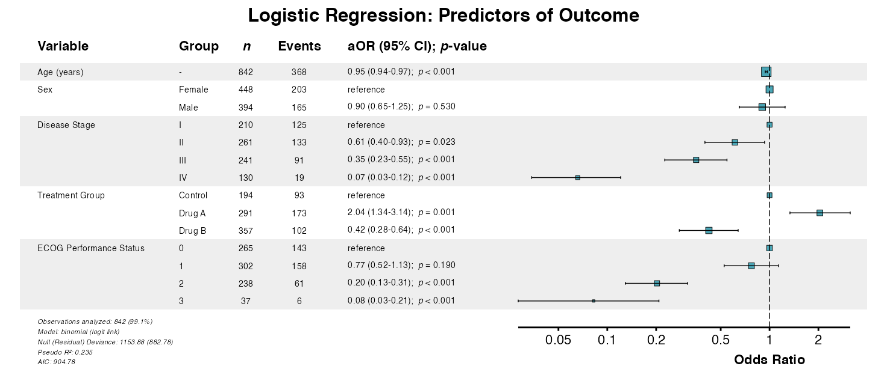

### **Example 2:** Linear Regression

For continuous outcomes, use
[`lmforest()`](https://phmcc.codeberg.page/summata/reference/lmforest.md):

``` r
linear_model <- lm(
  los_days ~ age + sex + stage + surgery + ecog,
  data = clintrial
)

example2 <- lmforest(
  x = linear_model,
  data = clintrial,
  title = "Linear Regression: Length of Stay",
  labels = clintrial_labels
)
queue_plot(example2)
```

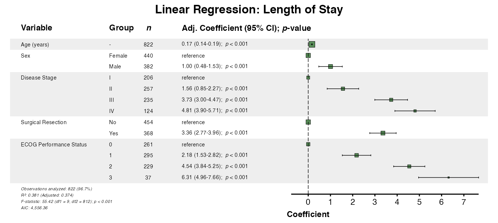

### **Example 3:** Cox Regression

For survival models, use
[`coxforest()`](https://phmcc.codeberg.page/summata/reference/coxforest.md):

``` r
cox_model <- coxph(
  Surv(os_months, os_status) ~ age + sex + stage + treatment + ecog,
  data = clintrial
)

example3 <- coxforest(
  x = cox_model,
  data = clintrial,
  title = "Cox Regression: Survival Analysis",
  labels = clintrial_labels
)
queue_plot(example3)
```


### **Example 4:** Automatic Model Detection

The
[`autoforest()`](https://phmcc.codeberg.page/summata/reference/autoforest.md)
function detects the model type automatically:

``` r
example4 <- autoforest(
  x = cox_model,
  data = clintrial,
  labels = clintrial_labels
)
queue_plot(example4)
```

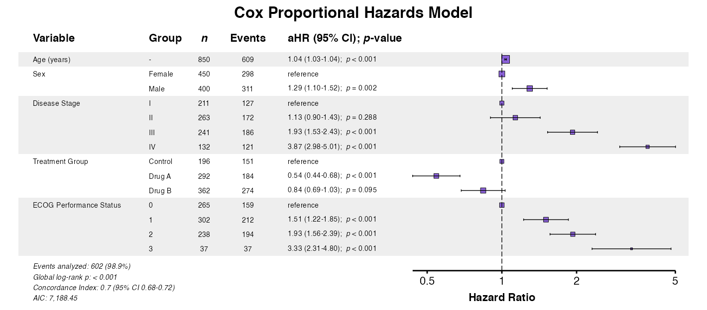

------------------------------------------------------------------------

## Creating Forest Plots from *summata* Output

Forest plots integrate seamlessly with
[`fit()`](https://phmcc.codeberg.page/summata/reference/fit.md) and
[`fullfit()`](https://phmcc.codeberg.page/summata/reference/fullfit.md)
output by extracting the attached model object.

### **Example 5:** Direct Extraction from Fit Output

The same approach works for logistic models:

``` r
table_logistic <- fit(
  data = clintrial,
  outcome = "surgery",
  predictors = c("age", "sex", "stage", "treatment", "ecog"),
  model_type = "glm",
  labels = clintrial_labels
)

example5 <- glmforest(
  x = attr(table_logistic, "model"),
  title = "Predictors of Surgical Intervention",
  labels = clintrial_labels,
  zebra_stripes = TRUE
)
queue_plot(example5)
```

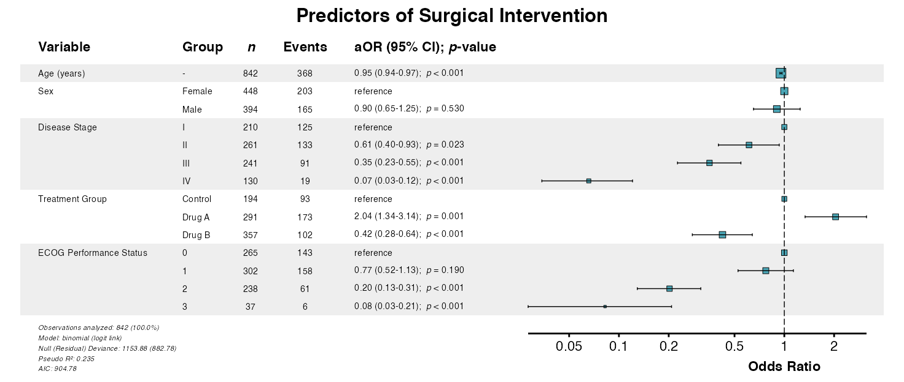

### **Example 6:** Model Attribute from Fit Output

And for Cox models:

``` r
table_cox <- fit(
  data = clintrial,
  outcome = "Surv(os_months, os_status)",
  predictors = c("age", "sex", "stage", "treatment", "ecog"),
  model_type = "coxph",
  labels = clintrial_labels
)

example6 <- coxforest(
  x = attr(table_cox, "model"),
  title = "Predictors of Overall Survival",
  labels = clintrial_labels,
  zebra_stripes = TRUE
)
queue_plot(example6)
```

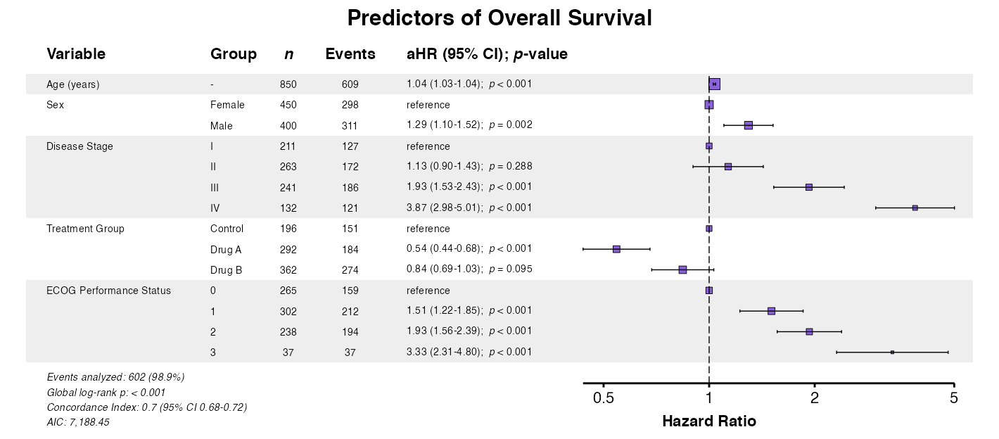

------------------------------------------------------------------------

## Display Options

### **Example 7:** Indenting Factor Levels

The `indent_groups` parameter creates hierarchical display for a more
compact aesthetic:

``` r
example7 <- glmforest(
  x = attr(table_logistic, "model"),
  title = "Indented Factor Levels",
  labels = clintrial_labels,
  indent_groups = TRUE
)
queue_plot(example7)
```

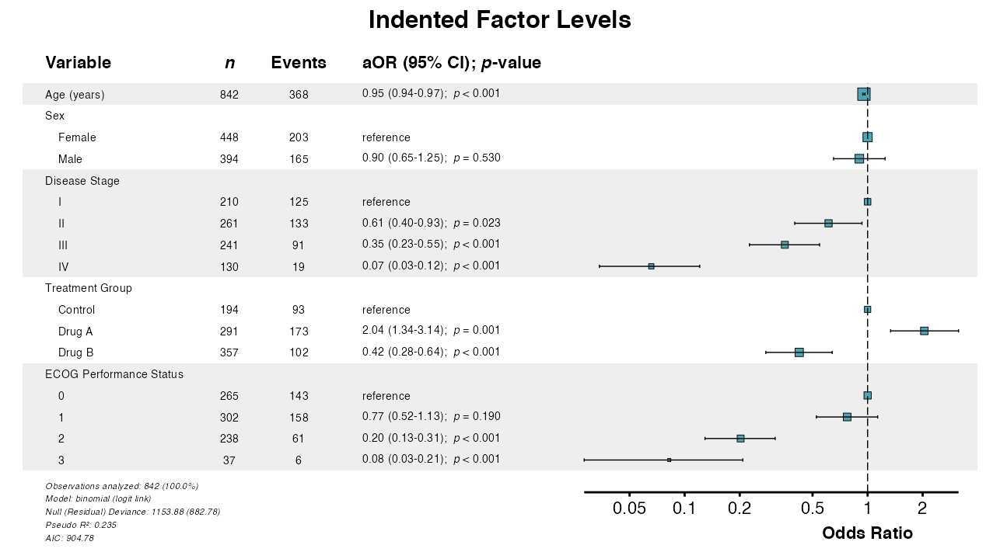

### **Example 8:** Condensing Binary Variables

The `condense_table` parameter displays binary variables on single rows.
Group indenting is applied automatically:

``` r
example8 <- glmforest(
  x = attr(table_logistic, "model"),
  title = "Condensed Display",
  labels = clintrial_labels,
  condense_table = TRUE
)
queue_plot(example8)
```

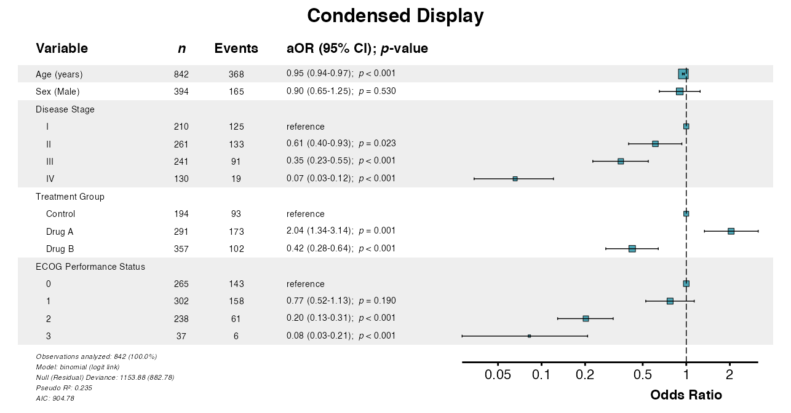

### **Example 9:** Toggle Zebra Striping

Zebra striping is enabled by default. It can be disabled via
`zebra_stripes = FALSE`:

``` r
example9 <- glmforest(
  x = attr(table_logistic, "model"),
  title = "Without Zebra Striping",
  labels = clintrial_labels,
  indent_groups = TRUE,
  zebra_stripes = FALSE
)
queue_plot(example9)
```

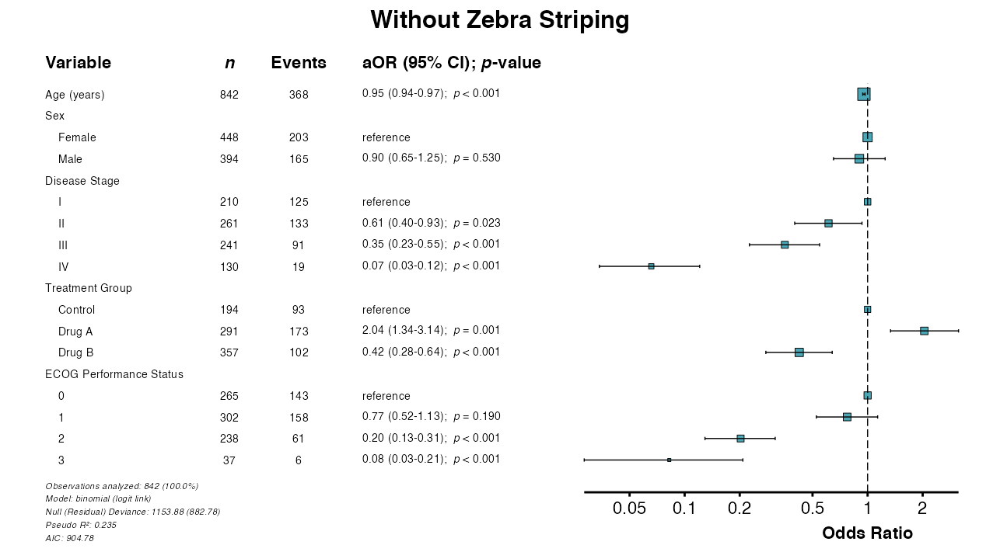

### **Example 10:** Sample Size and Event Columns

Control display of sample size (*n*) and event counts:

``` r
# Show both n and events
example10a <- coxforest(
  x = attr(table_cox, "model"),
  title = "With Sample Size and Events",
  labels = clintrial_labels,
  show_n = TRUE,
  show_events = TRUE,
  indent_groups = TRUE,
  zebra_stripes = TRUE
)
queue_plot(example10a)
```

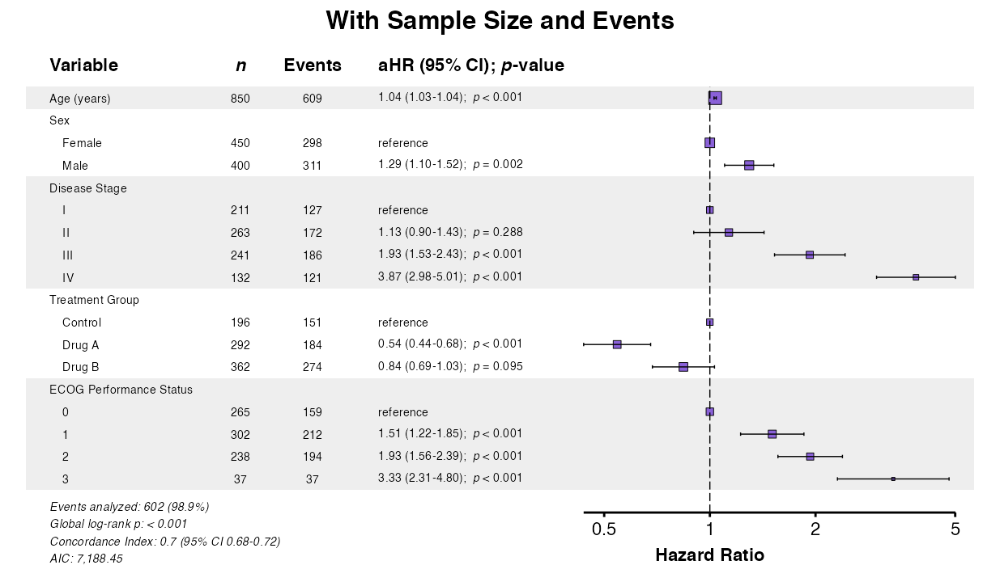

``` r
# Minimal display
example10b <- coxforest(
  x = attr(table_cox, "model"),
  title = "Minimal Display",
  labels = clintrial_labels,
  show_n = FALSE,
  show_events = FALSE,
  indent_groups = TRUE
)
queue_plot(example10b)
```

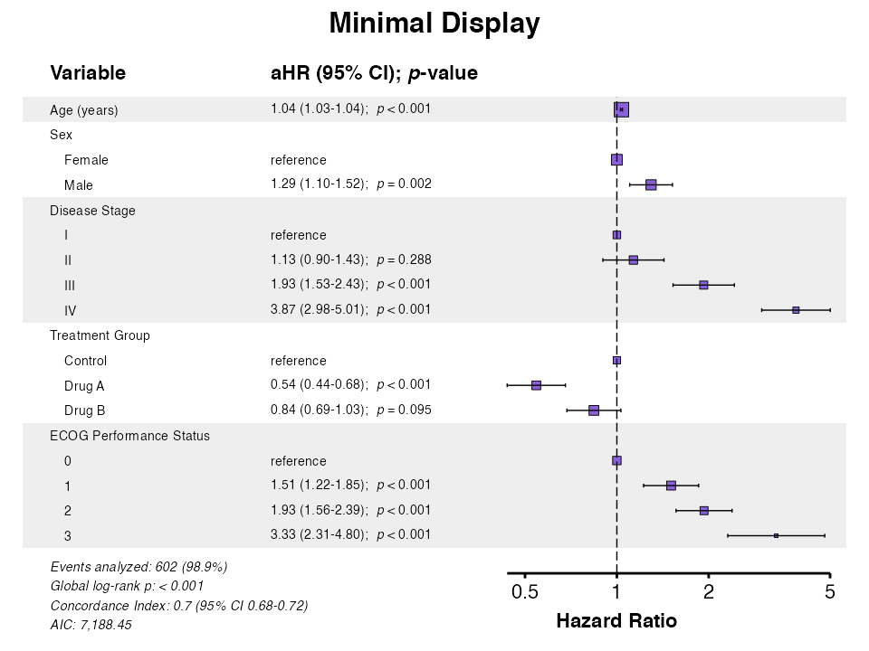

------------------------------------------------------------------------

## Formatting Options

### **Example 11:** Adjusting Numeric Precision

The `digits` parameter controls decimal places for effect estimates and
confidence intervals:

``` r
example11 <- glmforest(
  x = attr(table_logistic, "model"),
  title = "Custom Precision (3 decimal places)",
  labels = clintrial_labels,
  digits = 3,
  indent_groups = TRUE
)
queue_plot(example11)
```

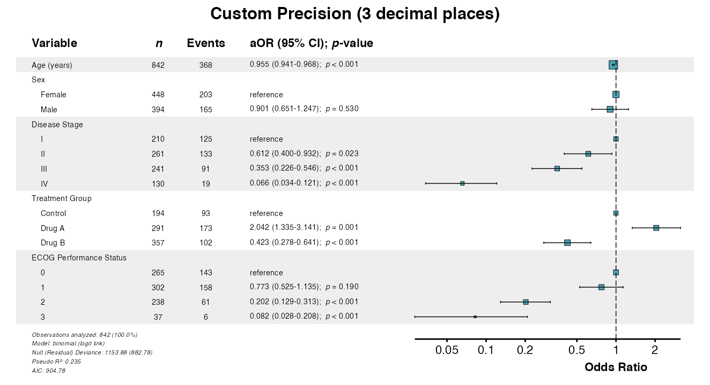

### **Example 12:** Custom Reference Label

Customize the label shown for reference categories:

``` r
example12 <- glmforest(
  x = attr(table_logistic, "model"),
  title = "Custom Reference Label",
  labels = clintrial_labels,
  ref_label = "ref",
  indent_groups = TRUE
)
queue_plot(example12)
```

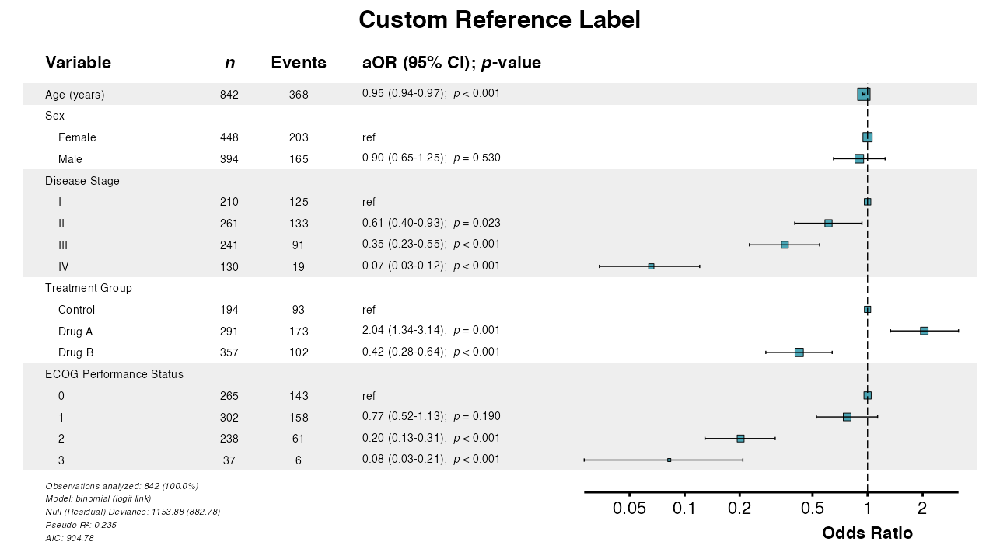

### **Example 13:** Custom Effect Measure Label

Change the column header for the effect measure:

``` r
example13 <- coxforest(
  x = attr(table_cox, "model"),
  title = "Custom Effect Label",
  labels = clintrial_labels,
  effect_label = "Effect (95% CI)",
  indent_groups = TRUE
)
queue_plot(example13)
```

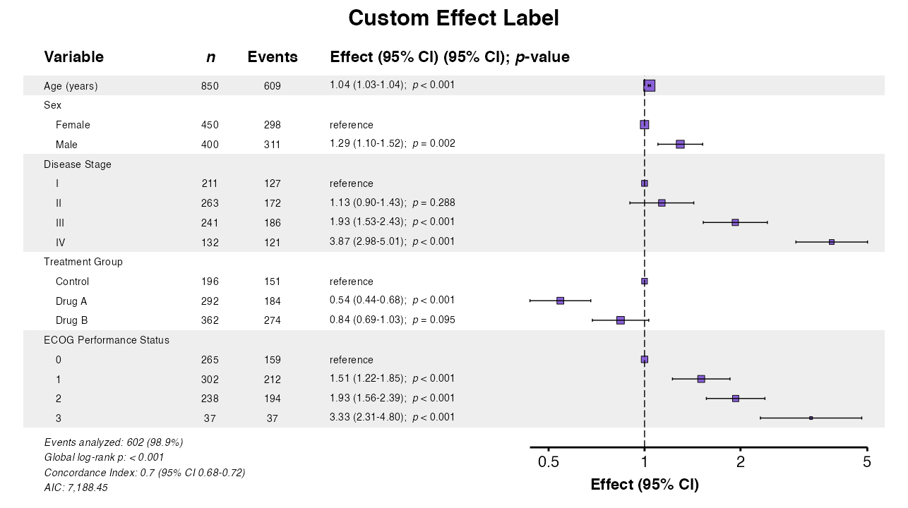

### **Example 14:** Custom Colors

The `color` parameter changes the point and line color:

``` r
example14 <- glmforest(
  x = attr(table_logistic, "model"),
  title = "Custom Color",
  labels = clintrial_labels,
  color = "#E41A1C",
  indent_groups = TRUE
)
queue_plot(example14)
```

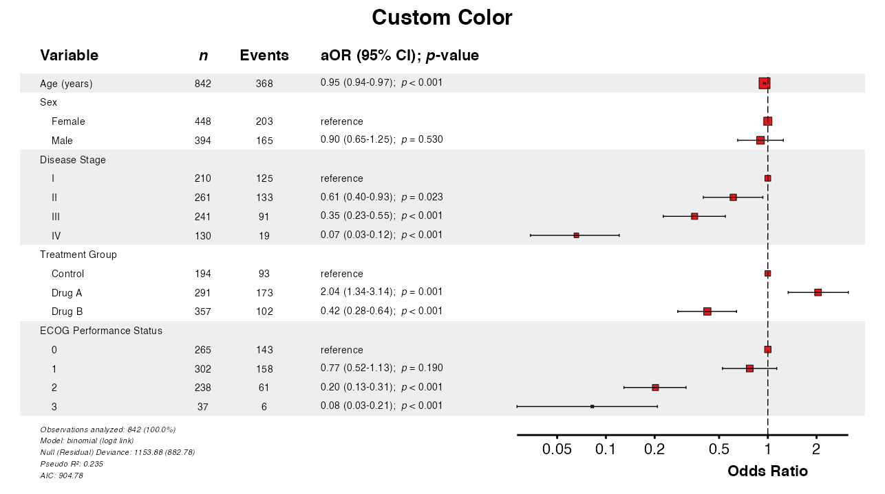

### **Example 15:** Change Font Sizes

Adjust text size with the `font_size` multiplier:

``` r
example15 <- glmforest(
  x = attr(table_logistic, "model"),
  title = "Larger Font (1.5×)",
  labels = clintrial_labels,
  font_size = 1.5,
  indent_groups = TRUE
)
queue_plot(example15)
```

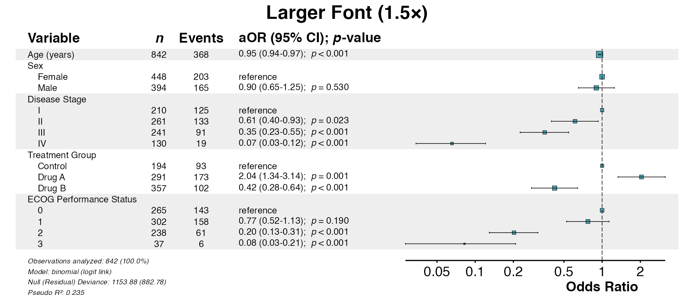

### **Example 16:** Table Width

The `table_width` parameter adjusts the proportion of space allocated to
the table vs. the forest plot:

``` r
# Wide table (for long variable names)
example16a <- glmforest(
  x = attr(table_logistic, "model"),
  title = "Wide Table (75%)",
  labels = clintrial_labels,
  table_width = 0.75
)
queue_plot(example16a)
```

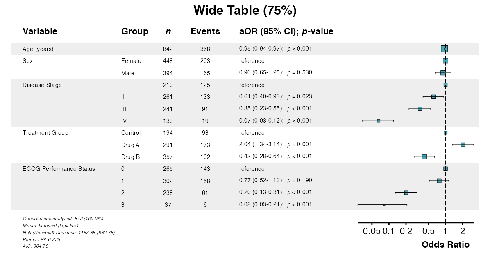

``` r
# Narrow table (emphasizes forest plot)
example16b <- glmforest(
  x = attr(table_logistic, "model"),
  title = "Narrow Table (50%)",
  labels = clintrial_labels,
  table_width = 0.50
)
queue_plot(example16b)
```

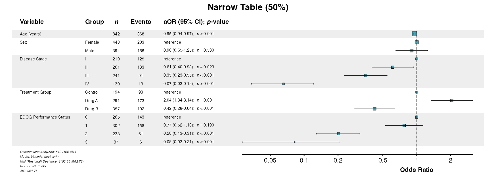

------------------------------------------------------------------------

## Saving Forest Plots

Forest plots include a `rec_dims` attribute for optimal sizing when
saving to files.

### **Example 17:** Recommended Dimensions

Use the recommended dimensions for optimal output:

``` r
p <- glmforest(
  x = attr(table_logistic, "model"),
  title = "Publication-Ready Plot",
  labels = clintrial_labels,
  indent_groups = TRUE,
  zebra_stripes = TRUE
)

# Get recommended dimensions
dims <- attr(p, "rec_dims")
cat("Width:", dims$width, "inches\n")
cat("Height:", dims$height, "inches\n")

# Save with recommended dimensions
ggsave(
  filename = file.path(tempdir(), "forest_plot.pdf"),
  plot = p,
  width = dims$width,
  height = dims$height,
  units = "in"
)
```

### **Example 18:** Multiple Formats

Export to different formats as needed:

``` r
p <- glmforest(
  x = attr(table_logistic, "model"),
  title = "Forest Plot",
  labels = clintrial_labels
)

dims <- attr(p, "rec_dims")

# PDF (vector, best for publications)
ggsave("forest.pdf", p, width = dims$width, height = dims$height)

# PNG (raster, good for presentations)
ggsave("forest.png", p, width = dims$width, height = dims$height, dpi = 300)

# TIFF (high-quality raster, often required by journals)
ggsave("forest.tiff", p, width = dims$width, height = dims$height, dpi = 300)

# SVG (vector, good for web)
ggsave("forest.svg", p, width = dims$width, height = dims$height)
```

------------------------------------------------------------------------

## Advanced Customization

Forest plots support extensive customization for publication
requirements.

### **Example 19:** Combined Options

Combine multiple options for publication-ready output:

``` r
example19 <- coxforest(
  x = attr(table_cox, "model"),
  title = "Comprehensive Survival Analysis",
  labels = clintrial_labels,
  effect_label = "Hazard Ratio",
  digits = 2,
  show_n = TRUE,
  show_events = TRUE,
  indent_groups = TRUE,
  condense_table = FALSE,
  zebra_stripes = TRUE,
  ref_label = "reference",
  font_size = 1.0,
  table_width = 0.62,
  color = "#8A61D8"
)
queue_plot(example19)
```

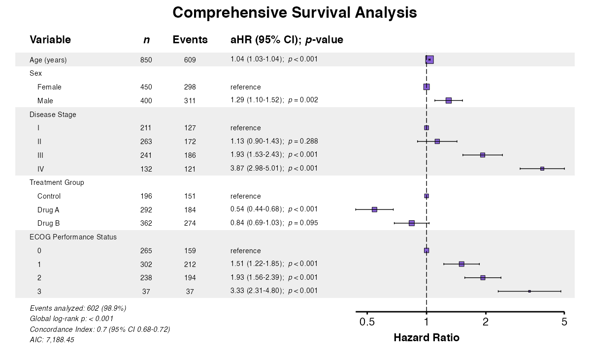

### **Example 20:** Extensions with ggplot2

Forest plots are `ggplot2` objects and can be modified further:

``` r
example20 <- glmforest(
  x = attr(table_logistic, "model"),
  title = "Extended with ggplot2",
  labels = clintrial_labels,
  indent_groups = TRUE
)

example20_modified <- example20 +
  theme(
    plot.title = element_text(face = "italic", color = "#A72727"),
    plot.background = element_rect(fill = "white", color = NA)
  )
queue_plot(example20_modified)
```

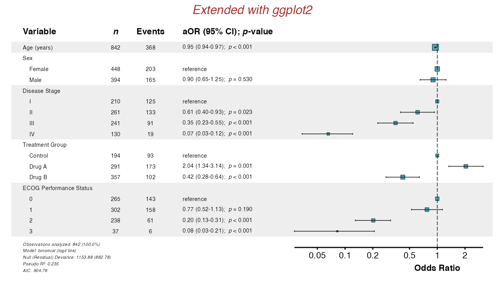

------------------------------------------------------------------------

## Additional GLM Families

The
[`glmforest()`](https://phmcc.codeberg.page/summata/reference/glmforest.md)
function supports all GLM families. These can be plotted in a similar
fashion to standard logistic regression forest plots. See [Regression
Modeling](https://phmcc.codeberg.page/summata/articles/regression_modeling.md)
for the full list of supported model types.

### **Example 21:** Poisson Regression

For equidispersed count outcomes (variance ≈ mean), use Poisson
regression:

``` r
poisson_model <- glm(
  fu_count ~ age + stage + treatment + surgery,
  data = clintrial,
  family = poisson
)

example21 <- glmforest(
  x = poisson_model,
  data = clintrial,
  title = "Poisson Regression: Follow-Up Visits",
  labels = clintrial_labels
)
queue_plot(example21)
```

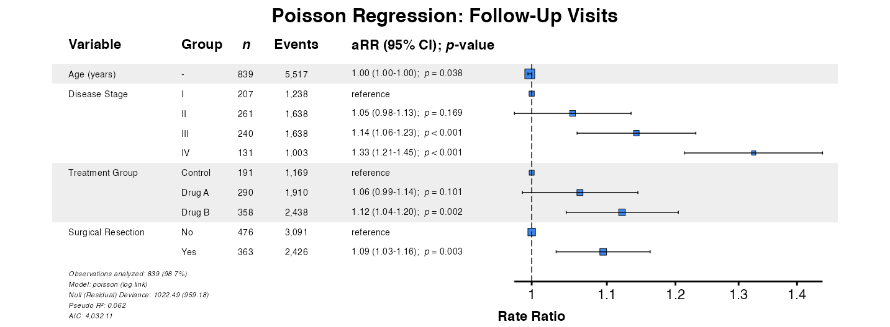

### **Example 22:** Negative Binomial Regression

For overdispersed count outcomes (variance \> mean), negative binomial
regression is preferred. Using
[`fit()`](https://phmcc.codeberg.page/summata/reference/fit.md) ensures
proper handling:

``` r
nb_result <- fit(
  data = clintrial,
  outcome = "ae_count",
  predictors = c("age", "treatment", "diabetes", "surgery"),
  model_type = "negbin",
  labels = clintrial_labels
)

example22 <- glmforest(
  x = nb_result,
  title = "Negative Binomial: Adverse Events"
)
queue_plot(example22)
```

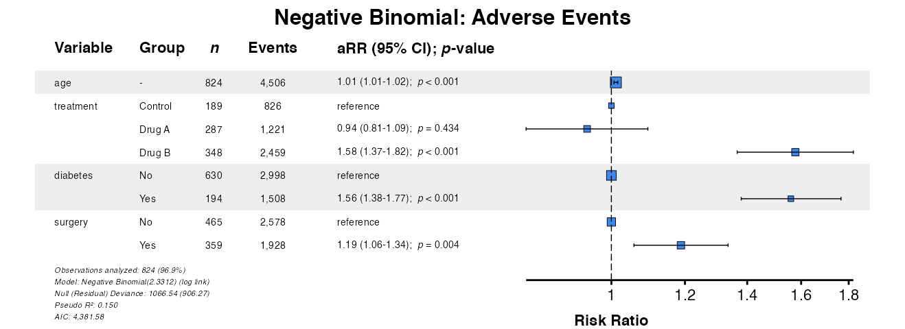

------------------------------------------------------------------------

## Function Parameter Summary

| Parameter | Description | Default |
|:---|:---|:---|
| `x` | Model object or model from [`fit()`](https://phmcc.codeberg.page/summata/reference/fit.md) output | Required |
| `data` | Data frame (required for model objects) | `NULL` |
| `title` | Plot title | `NULL` |
| `labels` | Named vector for variable labels | `NULL` |
| `indent_groups` | Indent factor levels under variable names | `FALSE` |
| `condense_table` | Show binary variables on single row | `FALSE` |
| `zebra_stripes` | Alternating row shading | `TRUE` |
| `show_n` | Display sample size column | `TRUE` |
| `show_events` | Display events column (Cox models) | `TRUE` |
| `digits` | Decimal places for estimates | `2` |
| `ref_label` | Label for reference categories | `"reference"` |
| `effect_label` | Column header for effect measure | Model-dependent |
| `color` | Color for points and lines | Effect-type dependent |
| `font_size` | Text size multiplier | `1.0` |
| `table_width` | Proportion of width for table | `0.55` |

------------------------------------------------------------------------

## Best Practices

### Model Preparation

1.  Ensure all factor levels are properly defined before fitting
2.  Use meaningful reference categories
3.  Consider centering continuous variables for interpretability
4.  Check model convergence before plotting

### Visual Design

1.  Use `indent_groups = TRUE` for cleaner presentation of categorical
    variables
2.  Match `table_width` to variable name lengths
3.  Consider `condense_table = TRUE` for binary predictors
4.  Use consistent colors across related figures

### Publication Preparation

1.  Use `rec_dims` attribute for optimal sizing
2.  Save as PDF for vector graphics in print
3.  Use 300+ DPI for raster formats
4.  Check that reference lines and confidence intervals are clearly
    visible

------------------------------------------------------------------------

## Common Issues

### Long Variable Names

If variable names are truncated, increase `table_width`:

``` r
p <- glmforest(model, table_width = 0.75)
```

### Overlapping Text

Reduce font size or increase figure dimensions:

``` r
p <- glmforest(model, font_size = 0.9)
ggsave(file.path(tempdir(), "plot.pdf"), p, width = 14, height = 8)
```

### Missing Labels

Ensure labels vector includes all variable names:

``` r
labels <- c(
  age = "Age (years)",
  sex = "Sex",
  stage = "Disease Stage"
)
p <- glmforest(model, labels = labels)
```

------------------------------------------------------------------------

## Further Reading

- [Descriptive
  Tables](https://phmcc.codeberg.page/summata/articles/descriptive_tables.md):
  [`desctable()`](https://phmcc.codeberg.page/summata/reference/desctable.md)
  for baseline characteristics
- [Survival
  Tables](https://phmcc.codeberg.page/summata/articles/survival_tables.md):
  [`survtable()`](https://phmcc.codeberg.page/summata/reference/survtable.md)
  for time-to-event summaries
- [Regression
  Modeling](https://phmcc.codeberg.page/summata/articles/regression_modeling.md):
  [`fit()`](https://phmcc.codeberg.page/summata/reference/fit.md),
  [`uniscreen()`](https://phmcc.codeberg.page/summata/reference/uniscreen.md),
  and
  [`fullfit()`](https://phmcc.codeberg.page/summata/reference/fullfit.md)
- [Model
  Comparison](https://phmcc.codeberg.page/summata/articles/model_comparison.md):
  [`compfit()`](https://phmcc.codeberg.page/summata/reference/compfit.md)
  for comparing models
- [Table
  Export](https://phmcc.codeberg.page/summata/articles/table_export.md):
  Export to PDF, Word, and other formats
- [Multivariate
  Regression](https://phmcc.codeberg.page/summata/articles/multivariate_regression.md):
  [`multifit()`](https://phmcc.codeberg.page/summata/reference/multifit.md)
  for multi-outcome analysis
- [Advanced
  Workflows](https://phmcc.codeberg.page/summata/articles/advanced_workflows.md):
  Interactions and mixed-effects models
