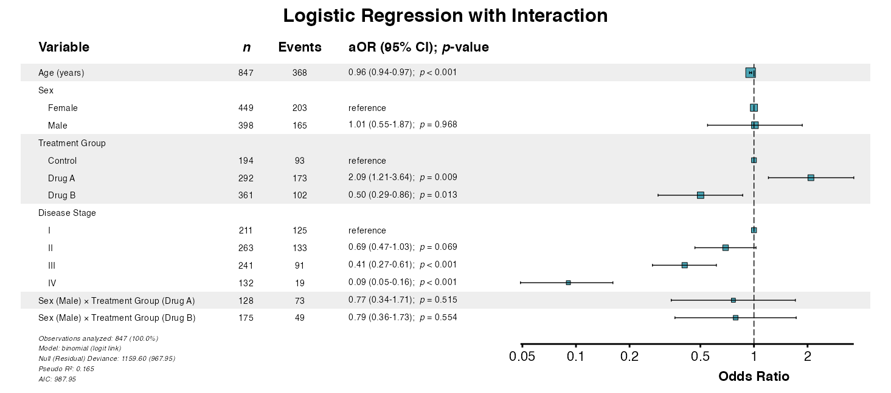
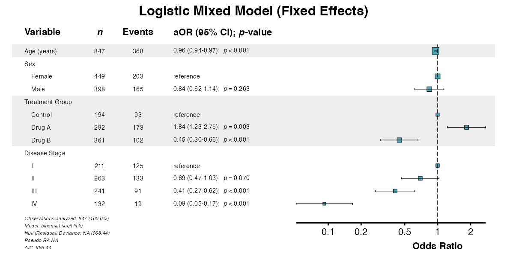
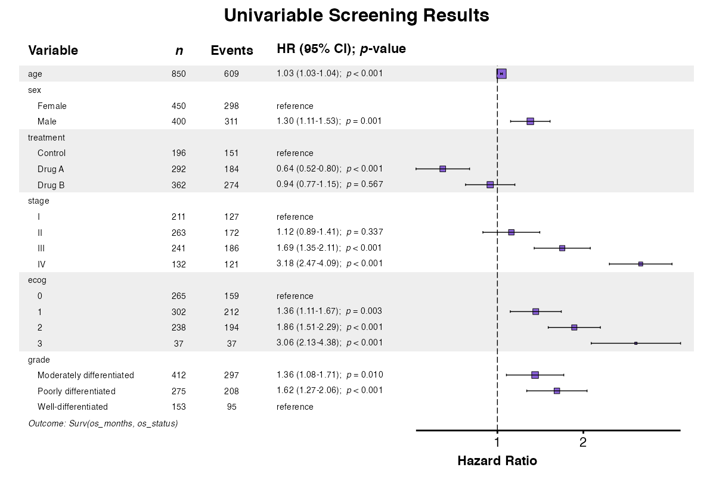
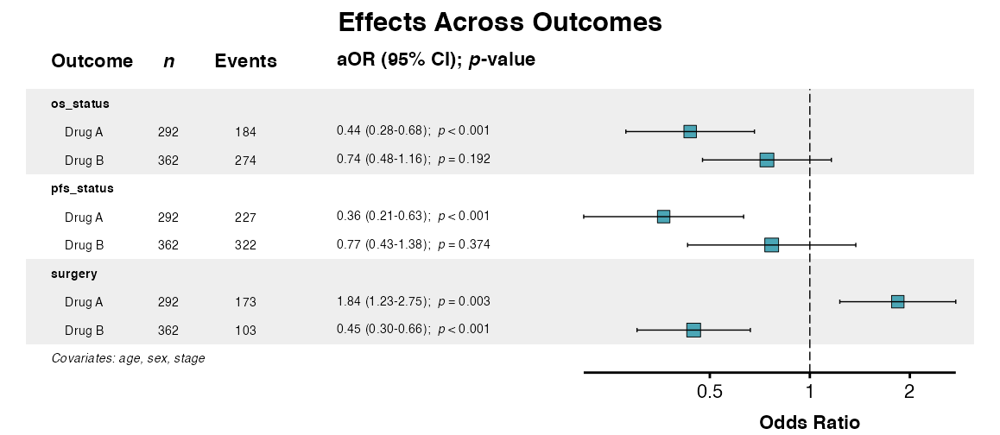

# Advanced Workflows

Standard regression analysis assumes independent observations and
constant effects across subgroups. In practice, these assumptions often
fail: observations may be clustered (e.g., subjects within study sites),
effects may vary by subgroup (interaction), or the baseline hazard may
differ across strata. This vignette demonstrates advanced analytical
techniques to address these complexities.

------------------------------------------------------------------------

## Preliminaries

The examples in this vignette use the `clintrial` dataset included with
`summata`:

``` r
library(summata)
library(survival)
library(ggplot2)

data(clintrial)
data(clintrial_labels)

# Examine the clustering structure
table(clintrial$site)
##> 
##>   Site Alpha    Site Beta   Site Gamma   Site Delta Site Epsilon    Site Zeta     Site Eta   Site Theta    Site Iota   Site Kappa 
##>           76           80           72           89           86           93           89           75          102           88
```

The `clintrial` dataset includes 10 study sites, providing a natural
clustering variable for hierarchical analysis.

> *n.b.:* To ensure correct font rendering and figure sizing, the forest
> plots below are displayed using a helper function (`queue_plot()`)
> that applies each plot’s recommended dimensions (stored in the
> `"rec_dims"` attribute) via the [`ragg`](https://ragg.r-lib.org/)
> graphics device. In practice, replace `queue_plot()` with
> [`ggplot2::ggsave()`](https://ggplot2.tidyverse.org/reference/ggsave.html)
> using recommended plot dimensions for equivalent results:
>
> ``` r
> p <- glmforest(model, data = mydata)
> dims <- attr(p, "rec_dims")
> ggplot2::ggsave("forest_plot.png", p,
>                 width = dims$width, 
>                 height = dims$height)
> ```
>
> This ensures that the figure size is always large enough to
> accommodate the constituent plot text and graphics, and it is
> generally the preferred method for saving forest plot outputs in
> `summata`.

------------------------------------------------------------------------

## Interaction Effects

Interaction analysis tests whether the association between a predictor
and outcome varies across levels of another variable. Interactions are
specified using colon notation in the `interactions` parameter; main
effects are automatically included alongside the interaction term.

### **Example 1:** Two-Way Interaction

Specify interactions using colon notation in the `interactions`
parameter:

``` r
example1 <- fit(
  data = clintrial,
  outcome = "surgery",
  predictors = c("age", "sex", "treatment", "stage"),
  interactions = c("sex:treatment"),
  model_type = "glm",
  labels = clintrial_labels
)

example1
##> 
##> Multivariable Logistic Model
##> Formula: surgery ~ age + sex + treatment + stage + sex:treatment
##> n = 847, Events = 368
##> 
##>                                  Variable   Group      n Events     aOR (95% CI) p-value
##>                                    <char>  <char> <char> <char>           <char>  <char>
##>  1:                           Age (years)       -    847    368 0.96 (0.94-0.97) < 0.001
##>  2:                                   Sex  Female    449    203        reference       -
##>  3:                                          Male    398    165 1.01 (0.55-1.87)   0.968
##>  4:                       Treatment Group Control    194     93        reference       -
##>  5:                                        Drug A    292    173 2.09 (1.20-3.62)   0.009
##>  6:                                        Drug B    361    102 0.50 (0.29-0.87)   0.013
##>  7:                         Disease Stage       I    211    125        reference       -
##>  8:                                            II    263    133 0.69 (0.47-1.03)   0.069
##>  9:                                           III    241     91 0.41 (0.27-0.62) < 0.001
##> 10:                                            IV    132     19 0.09 (0.05-0.16) < 0.001
##> 11: Sex (Male) × Treatment Group (Drug A)       -    128     73 0.77 (0.34-1.71)   0.515
##> 12: Sex (Male) × Treatment Group (Drug B)       -    175     49 0.79 (0.36-1.73)   0.554
```

### **Example 2:** Multiple Interactions

Test multiple effect modifiers simultaneously:

``` r
example2 <- fit(
  data = clintrial,
  outcome = "Surv(os_months, os_status)",
  predictors = c("age", "sex", "treatment", "stage"),
  interactions = c("sex:treatment", "stage:treatment"),
  model_type = "coxph",
  labels = clintrial_labels
)

example2
##> 
##> Multivariable Cox PH Model
##> Formula: Surv(os_months, os_status) ~ age + sex + treatment + stage + sex:treatment + stage:treatment
##> n = 847, Events = 606
##> 
##>                                           Variable   Group      n Events     aHR (95% CI) p-value
##>                                             <char>  <char> <char> <char>           <char>  <char>
##>  1:                                    Age (years)       -    847    606 1.04 (1.03-1.04) < 0.001
##>  2:                                            Sex  Female    450    298        reference       -
##>  3:                                                   Male    400    311 1.32 (0.95-1.83)   0.094
##>  4:                                Treatment Group Control    196    151        reference       -
##>  5:                                                 Drug A    292    184 0.70 (0.43-1.14)   0.153
##>  6:                                                 Drug B    362    274 0.67 (0.41-1.09)   0.106
##>  7:                                  Disease Stage       I    211    127        reference       -
##>  8:                                                     II    263    172 1.11 (0.73-1.70)   0.624
##>  9:                                                    III    241    186 1.94 (1.21-3.09)   0.006
##> 10:                                                     IV    132    121 3.69 (2.28-5.97) < 0.001
##> 11:          Sex (Male) × Treatment Group (Drug A)       -    128     89 1.11 (0.72-1.72)   0.637
##> 12:          Sex (Male) × Treatment Group (Drug B)       -    176    143 0.98 (0.65-1.46)   0.903
##> 13:  Treatment Group (Drug A) × Disease Stage (II)       -     93     52 0.75 (0.42-1.35)   0.339
##> 14: Treatment Group (Drug A) × Disease Stage (III)       -     75     50 0.65 (0.35-1.20)   0.171
##> 15:  Treatment Group (Drug A) × Disease Stage (IV)       -     46     37 0.70 (0.37-1.34)   0.287
##> 16:  Treatment Group (Drug B) × Disease Stage (II)       -    105     73 1.37 (0.78-2.42)   0.278
##> 17: Treatment Group (Drug B) × Disease Stage (III)       -    127    103 1.30 (0.72-2.35)   0.375
##> 18:  Treatment Group (Drug B) × Disease Stage (IV)       -     55     54 1.24 (0.66-2.31)   0.504
```

### **Example 3:** Continuous × Categorical Interaction

Test whether effects of a continuous variable vary by group:

``` r
example3 <- fit(
  data = clintrial,
  outcome = "los_days",
  predictors = c("age", "sex", "treatment", "stage", "surgery"),
  interactions = c("age:treatment"),
  model_type = "lm",
  labels = clintrial_labels
)

example3
##> 
##> Multivariable Linear Model
##> Formula: los_days ~ age + sex + treatment + stage + surgery + age:treatment
##> n = 827
##> 
##>                                   Variable   Group      n Adj. Coefficient (95% CI) p-value
##>                                     <char>  <char> <char>                    <char>  <char>
##>  1:                            Age (years)       -    827       0.14 (0.09 to 0.19) < 0.001
##>  2:                                    Sex  Female    441                 reference       -
##>  3:                                           Male    386       0.99 (0.46 to 1.52) < 0.001
##>  4:                        Treatment Group Control    190                 reference       -
##>  5:                                         Drug A    288     -2.39 (-6.00 to 1.23)   0.197
##>  6:                                         Drug B    349      0.03 (-3.51 to 3.58)   0.985
##>  7:                          Disease Stage       I    207                 reference       -
##>  8:                                             II    259       1.33 (0.62 to 2.04) < 0.001
##>  9:                                            III    235       3.10 (2.36 to 3.84) < 0.001
##> 10:                                             IV    126       4.32 (3.42 to 5.22) < 0.001
##> 11:                     Surgical Resection      No    459                 reference       -
##> 12:                                            Yes    368       3.29 (2.69 to 3.88) < 0.001
##> 13: Age (years) × Treatment Group (Drug A)       -    288      0.02 (-0.04 to 0.08)   0.557
##> 14: Age (years) × Treatment Group (Drug B)       -    349      0.05 (-0.01 to 0.11)   0.114
```

### **Example 4:** Interaction in fullfit()

Include interaction terms in combined univariable/multivariable
analysis:

``` r
example4 <- fullfit(
  data = clintrial,
  outcome = "surgery",
  predictors = c("age", "sex", "treatment", "stage", "sex:treatment"),
  model_type = "glm",
  method = "all",
  labels = clintrial_labels
)

example4
##> 
##> Fullfit Analysis Results
##> Outcome: surgery
##> Model Type: glm
##> Method: all
##> Predictors Screened: 5
##> Multivariable Predictors: 5
##> 
##>                                     Variable   Group      n Events      OR (95% CI)   Uni p     aOR (95% CI) Multi p
##>                                       <char>  <char> <char> <char>           <char>  <char>           <char>  <char>
##>  1:                              Age (years)       -    850    370 0.96 (0.95-0.98) < 0.001 0.96 (0.94-0.97) < 0.001
##>  2:                                      Sex  Female    450    204        reference       -        reference       -
##>  3:                                             Male    400    166 0.86 (0.65-1.12)   0.261 1.01 (0.55-1.87)   0.968
##>  4:                          Treatment Group Control    196     94        reference       -        reference       -
##>  5:                                           Drug A    292    173 1.58 (1.10-2.27)   0.014 2.09 (1.20-3.62)   0.009
##>  6:                                           Drug B    362    103 0.43 (0.30-0.62) < 0.001 0.50 (0.29-0.87)   0.013
##>  7:                            Disease Stage       I    211    125        reference       -        reference       -
##>  8:                                               II    263    133 0.70 (0.49-1.01)   0.060 0.69 (0.47-1.03)   0.069
##>  9:                                              III    241     91 0.42 (0.29-0.61) < 0.001 0.41 (0.27-0.62) < 0.001
##> 10:                                               IV    132     19 0.12 (0.07-0.20) < 0.001 0.09 (0.05-0.16) < 0.001
##> 11: Sex (Female) × Treatment Group (Control)       -    100     51 2.62 (1.57-4.37) < 0.001                -       -
##> 12:   Sex (Male) × Treatment Group (Control)       -     96     43 2.04 (1.22-3.43)   0.007                -       -
##> 13:  Sex (Female) × Treatment Group (Drug A)       -    164    100 3.94 (2.50-6.20) < 0.001                -       -
##> 14:    Sex (Male) × Treatment Group (Drug A)       -    128     73 3.34 (2.07-5.40) < 0.001 0.77 (0.34-1.71)   0.515
##> 15:  Sex (Female) × Treatment Group (Drug B)       -    186     53 1.00 (0.64-1.59)   0.986                -       -
```

### **Example 5:** Testing Interaction Significance

Use [`compfit()`](https://phmcc.github.io/summata/reference/compfit.md)
to formally evaluate whether interactions improve model fit (*see*
[Model
Comparison](https://phmcc.github.io/summata/articles/model_comparison.md)):

``` r
example5 <- compfit(
  data = clintrial,
  outcome = "surgery",
  model_list = list(
    "Main Effects" = c("age", "sex", "treatment", "stage"),
    "Sex × Treatment" = c("age", "sex", "treatment", "stage"),
    "Stage × Treatment" = c("age", "sex", "treatment", "stage"),
    "Both Interactions" = c("age", "sex", "treatment", "stage")
  ),
  interactions_list = list(
    NULL,
    c("sex:treatment"),
    c("stage:treatment"),
    c("sex:treatment", "stage:treatment")
  ),
  model_type = "glm",
  labels = clintrial_labels
)

example5
##> 
##> Model Comparison Results
##> Outcome: surgery
##> Model Type: glm
##> 
##> CMS Weights:
##>   Convergence: 15%
##>   AIC: 25%
##>   Concordance: 40%
##>   Pseudo-R²: 15%
##>   Brier score: 5%
##> 
##> Recommended Model: Main Effects (CMS: 75.4)
##> 
##> Models ranked by selection score:
##>                Model   CMS     N Events Predictors Converged   AIC    BIC Pseudo-R² Concordance Brier Score Global p
##>               <char> <num> <int>  <num>      <int>    <char> <num>  <num>     <num>       <num>       <num>   <char>
##> 1:      Main Effects  75.4   847    368          4       Yes 984.4 1022.4     0.165       0.765       0.195  < 0.001
##> 2:   Sex × Treatment  68.6   847    368          4       Yes 987.9 1035.4     0.165       0.765       0.195  < 0.001
##> 3: Stage × Treatment  57.2   847    368          4       Yes 993.8 1060.1     0.167       0.766       0.194  < 0.001
##> 4: Both Interactions  50.6   847    368          4       Yes 997.2 1073.1     0.168       0.766       0.194  < 0.001
##> 
##> CMS interpretation: 85+ Excellent, 75-84 Very Good, 65-74 Good, 55-64 Fair, < 55 Poor
```

### **Example 6:** Forest Plot with Interactions

Visualize models including interaction terms:

``` r
interaction_model <- fit(
  data = clintrial,
  outcome = "surgery",
  predictors = c("age", "sex", "treatment", "stage"),
  interactions = c("sex:treatment"),
  model_type = "glm",
  labels = clintrial_labels
)

example6 <- glmforest(
  x = attr(interaction_model, "model"),
  title = "Logistic Regression with Interaction",
  labels = clintrial_labels,
  indent_groups = TRUE,
  zebra_stripes = TRUE
)
queue_plot(example6)
```



------------------------------------------------------------------------

## Mixed-Effects Models

Mixed-effects models (multilevel or hierarchical models) account for
correlation within clusters by incorporating random effects. The
`summata` package supports linear mixed models (`lmer`), generalized
linear mixed models (`glmer`), and Cox mixed models (`coxme`).

Random effects are specified using pipe notation within either the
`predictors` parameter or in a separate `random` parameter:

| Syntax              | Meaning                              |
|:--------------------|:-------------------------------------|
| `(1\|group)`        | Random intercepts by group           |
| `(x\|group)`        | Random intercepts and slopes for *x* |
| `(1\|g1) + (1\|g2)` | Crossed random effects               |

### **Example 7:** Random Intercepts (Linear Mixed)

The `(1|site)` syntax specifies a random intercept for each site:

``` r
example7 <- fit(
  data = clintrial,
  outcome = "los_days",
  predictors = c("age", "sex", "treatment", "stage", "(1|site)"),
  model_type = "lmer",
  labels = clintrial_labels
)

example7
##> 
##> Multivariable Linear Mixed Model
##> Formula: los_days ~ age + sex + treatment + stage + (1|site)
##> n = 827
##> 
##>            Variable   Group      n Adj. Coefficient (95% CI) p-value
##>              <char>  <char> <char>                    <char>  <char>
##>  1:     Age (years)       -    827       0.14 (0.11 to 0.16) < 0.001
##>  2:             Sex  Female    441                 reference       -
##>  3:                    Male    386       0.82 (0.28 to 1.37)   0.003
##>  4: Treatment Group Control    190                 reference       -
##>  5:                  Drug A    288    -0.94 (-1.68 to -0.20)   0.013
##>  6:                  Drug B    349       2.41 (1.70 to 3.13) < 0.001
##>  7:   Disease Stage       I    207                 reference       -
##>  8:                      II    259       1.25 (0.51 to 1.98) < 0.001
##>  9:                     III    235       2.43 (1.67 to 3.19) < 0.001
##> 10:                      IV    126       2.96 (2.07 to 3.85) < 0.001
```

### **Example 8:** Random Intercepts (Logistic Mixed)

For binary outcomes with clustering (note the use of an independent
`random` parameter):

``` r
example8 <- fit(
    data = clintrial,
    outcome = "surgery",
    predictors = c("age", "sex", "treatment", "stage"),
    random = "(1|site)",
    model_type = "glmer",
    labels = clintrial_labels
)

example8
##> 
##> Multivariable glmerMod Model
##> Formula: surgery ~ age + sex + treatment + stage + (1|site)
##> n = 847, Events = 368
##> 
##>            Variable   Group      n Events     aOR (95% CI) p-value
##>              <char>  <char> <char> <char>           <char>  <char>
##>  1:     Age (years)       -    847    368 0.96 (0.94-0.97) < 0.001
##>  2:             Sex  Female    449    203        reference       -
##>  3:                    Male    398    165 0.84 (0.62-1.14)   0.263
##>  4: Treatment Group Control    194     93        reference       -
##>  5:                  Drug A    292    173 1.84 (1.23-2.75)   0.003
##>  6:                  Drug B    361    102 0.45 (0.30-0.66) < 0.001
##>  7:   Disease Stage       I    211    125        reference       -
##>  8:                      II    263    133 0.69 (0.47-1.03)   0.070
##>  9:                     III    241     91 0.41 (0.27-0.62) < 0.001
##> 10:                      IV    132     19 0.09 (0.05-0.17) < 0.001
```

### **Example 9:** Random Slopes

Allow effects to vary by cluster:

``` r
example9 <- fit(
  data = clintrial,
  outcome = "los_days",
  predictors = c("age", "sex", "treatment", "stage", "(1 + treatment|site)"),
  model_type = "lmer",
  labels = clintrial_labels
)

example9
##> 
##> Multivariable Linear Mixed Model
##> Formula: los_days ~ age + sex + treatment + stage + (1 + treatment|site)
##> n = 827
##> 
##>            Variable   Group      n Adj. Coefficient (95% CI) p-value
##>              <char>  <char> <char>                    <char>  <char>
##>  1:     Age (years)       -    827       0.14 (0.11 to 0.16) < 0.001
##>  2:             Sex  Female    441                 reference       -
##>  3:                    Male    386       0.83 (0.28 to 1.38)   0.003
##>  4: Treatment Group Control    190                 reference       -
##>  5:                  Drug A    288    -0.95 (-1.81 to -0.09)   0.031
##>  6:                  Drug B    349       2.40 (1.65 to 3.16) < 0.001
##>  7:   Disease Stage       I    207                 reference       -
##>  8:                      II    259       1.27 (0.53 to 2.00) < 0.001
##>  9:                     III    235       2.44 (1.68 to 3.20) < 0.001
##> 10:                      IV    126       3.01 (2.12 to 3.90) < 0.001
```

### **Example 10:** Cox Mixed-Effects Model

For survival outcomes with clustering:

``` r
example10 <- fit(
  data = clintrial,
  outcome = "Surv(os_months, os_status)",
  predictors = c("age", "sex", "treatment", "stage", "(1|site)"),
  model_type = "coxme",
  labels = clintrial_labels
)

example10
##> 
##> Multivariable Mixed Effects Cox Model
##> Formula: Surv(os_months, os_status) ~ age + sex + treatment + stage + (1|site)
##> n = 847, Events = 606
##> 
##>            Variable   Group      n Events     aHR (95% CI) p-value
##>              <char>  <char> <char> <char>           <char>  <char>
##>  1:     Age (years)       -    847    606 1.04 (1.03-1.05) < 0.001
##>  2:             Sex  Female    450    298        reference       -
##>  3:                    Male    400    311 1.36 (1.16-1.60) < 0.001
##>  4: Treatment Group Control    196    151        reference       -
##>  5:                  Drug A    292    184 0.57 (0.46-0.72) < 0.001
##>  6:                  Drug B    362    274 0.93 (0.76-1.14)   0.492
##>  7:   Disease Stage       I    211    127        reference       -
##>  8:                      II    263    172 1.17 (0.93-1.48)   0.178
##>  9:                     III    241    186 2.04 (1.62-2.58) < 0.001
##> 10:                      IV    132    121 4.09 (3.16-5.30) < 0.001
```

### **Example 11:** Forest Plot from Mixed Model

Visualize fixed effects from mixed-effects models:

``` r
example11 <- glmforest(
  x = attr(example8, "model"),
  title = "Logistic Mixed Model (Fixed Effects)",
  labels = clintrial_labels,
  indent_groups = TRUE,
  zebra_stripes = TRUE
)
queue_plot(example11)
```



### **Example 12:** Comparing Random-Effects Specifications

Use [`compfit()`](https://phmcc.github.io/summata/reference/compfit.md)
to compare different random-effects structures (*see* [Model
Comparison](https://phmcc.github.io/summata/articles/model_comparison.md)):

``` r
example12 <- compfit(
  data = clintrial,
  outcome = "los_days",
  model_list = list(
    "Random Intercepts" = c("age", "sex", "treatment", "stage", "(1|site)"),
    "Random Slopes" = c("age", "sex", "treatment", "stage", "(1 + treatment|site)")
  ),
  model_type = "lmer",
  labels = clintrial_labels
)

example12
##> 
##> Model Comparison Results
##> Outcome: los_days
##> Model Type: lmer
##> 
##> CMS Weights:
##>   Convergence: 20%
##>   AIC: 25%
##>   Marginal R²: 25%
##>   Conditional R²: 15%
##>   ICC: 15%
##> 
##> Recommended Model: Random Intercepts (CMS: 74)
##> 
##> Models ranked by selection score:
##>                Model   CMS     N Events Predictors Groups Converged    AIC    BIC Pseudo-R² Marginal R² Conditional R²   ICC Concordance Global p
##>               <char> <num> <int>  <num>      <int>  <int>    <char>  <num>  <num>     <num>       <num>          <num> <num>       <num>   <char>
##> 1: Random Intercepts  74.0   827     NA          5     10       Yes 4679.8 4727.0     0.275       0.275          0.330 0.076          NA  < 0.001
##> 2:     Random Slopes  49.1   827     NA          5     10       Yes 4688.5 4759.3     0.276       0.276          0.334 0.098          NA  < 0.001
##> 
##> CMS interpretation: 85+ Excellent, 75-84 Very Good, 65-74 Good, 55-64 Fair, < 55 Poor
```

------------------------------------------------------------------------

## Stratification and Clustering

In addition to mixed-effects models, Cox models support stratification
(separate baseline hazards) and clustered standard errors (robust
variance estimation).

| Approach | When to Use |
|:---|:---|
| Mixed-effects | Model cluster-specific effects; prediction at cluster level |
| Stratification | Proportional hazards assumption violated for a variable |
| Clustered SE | Correlation within clusters; robust inference |

### **Example 13:** Stratified Cox Model

Stratification allows nonproportional hazards across strata without
estimating stratum effects. Use the `strata` parameter:

``` r
example13 <- fit(
  data = clintrial,
  outcome = "Surv(os_months, os_status)",
  predictors = c("age", "sex", "treatment"),
  strata = "site",
  model_type = "coxph",
  labels = clintrial_labels
)

example13
##> 
##> Multivariable Cox PH Model
##> Formula: Surv(os_months, os_status) ~ age + sex + treatment + strata( site )
##> n = 850, Events = 609
##> 
##>           Variable   Group      n Events     aHR (95% CI) p-value
##>             <char>  <char> <char> <char>           <char>  <char>
##> 1:     Age (years)       -    850    609 1.04 (1.03-1.04) < 0.001
##> 2:             Sex  Female    450    298        reference       -
##> 3:                    Male    400    311 1.28 (1.09-1.50)   0.003
##> 4: Treatment Group Control    196    151        reference       -
##> 5:                  Drug A    292    184 0.62 (0.50-0.77) < 0.001
##> 6:                  Drug B    362    274 1.00 (0.81-1.22)   0.976
```

### **Example 14:** Cluster-Robust SEs

For robust inference with correlated observations, cluster-robust
standard errors account for within-cluster correlation. Use the
`cluster` parameter:

``` r
example14 <- fit(
  data = clintrial,
  outcome = "Surv(os_months, os_status)",
  predictors = c("age", "sex", "treatment", "stage"),
  cluster = "site",
  model_type = "coxph",
  labels = clintrial_labels
)

example14
##> 
##> Multivariable Cox PH Model
##> Formula: Surv(os_months, os_status) ~ age + sex + treatment + stage
##> n = 847, Events = 606
##> 
##>            Variable   Group      n Events     aHR (95% CI) p-value
##>              <char>  <char> <char> <char>           <char>  <char>
##>  1:     Age (years)       -    847    606 1.04 (1.03-1.04) < 0.001
##>  2:             Sex  Female    450    298        reference       -
##>  3:                    Male    400    311 1.33 (1.19-1.48) < 0.001
##>  4: Treatment Group Control    196    151        reference       -
##>  5:                  Drug A    292    184 0.56 (0.40-0.78) < 0.001
##>  6:                  Drug B    362    274 0.83 (0.63-1.08)   0.167
##>  7:   Disease Stage       I    211    127        reference       -
##>  8:                      II    263    172 1.16 (0.93-1.44)   0.189
##>  9:                     III    241    186 1.90 (1.61-2.23) < 0.001
##> 10:                      IV    132    121 3.57 (2.86-4.46) < 0.001
```

------------------------------------------------------------------------

## Weighted Regression

For survey data or inverse probability weighting, use the `weights`
parameter. Weights can account for sampling design, non-response, or
confounding adjustment.

### **Example 15:** Weighted Analysis

``` r
# Create example weights
clintrial$analysis_weight <- runif(nrow(clintrial), 0.5, 2.0)

example15 <- fit(
  data = clintrial,
  outcome = "surgery",
  predictors = c("age", "sex", "treatment", "stage"),
  weights = "analysis_weight",
  model_type = "glm",
  labels = clintrial_labels
)

example15
##> 
##> Multivariable Logistic Model
##> Formula: surgery ~ age + sex + treatment + stage
##> n = 847, Events = 368
##> 
##>            Variable   Group      n Events     aOR (95% CI) p-value
##>              <char>  <char> <char> <char>           <char>  <char>
##>  1:     Age (years)       -    847    368 0.96 (0.95-0.98) < 0.001
##>  2:             Sex  Female    449    203        reference       -
##>  3:                    Male    398    165 0.80 (0.61-1.05)   0.109
##>  4: Treatment Group Control    194     93        reference       -
##>  5:                  Drug A    292    173 1.71 (1.19-2.45)   0.004
##>  6:                  Drug B    361    102 0.42 (0.29-0.59) < 0.001
##>  7:   Disease Stage       I    211    125        reference       -
##>  8:                      II    263    133 0.68 (0.48-0.96)   0.028
##>  9:                     III    241     91 0.40 (0.28-0.58) < 0.001
##> 10:                      IV    132     19 0.08 (0.04-0.13) < 0.001
```

------------------------------------------------------------------------

## Advanced Univariable Screening Features

The
[`uniscreen()`](https://phmcc.github.io/summata/reference/uniscreen.md)
function supports advanced model specifications including random effects
and stratification.

### **Example 16:** Univariable Screening with Random Effects

Screen multiple predictors while accounting for clustering:

``` r
example16 <- uniscreen(
  data = clintrial,
  outcome = "surgery",
  predictors = c("age", "sex", "treatment", "stage"),
  model_type = "glmer",
  random = "(1|site)",
  labels = clintrial_labels
)

example16
##> 
##> Univariable Screening Results
##> Outcome: surgery
##> Model Type: glmerMod
##> Predictors Screened: 4
##> Significant (p < 0.05): 3
##> 
##>            Variable   Group      n Events      OR (95% CI) p-value
##>              <char>  <char> <char> <char>           <char>  <char>
##>  1:     Age (years)       -    850    370 0.96 (0.95-0.98) < 0.001
##>  2:             Sex  Female    450    204        reference       -
##>  3:                    Male    400    166 0.85 (0.65-1.12)   0.256
##>  4: Treatment Group Control    196     94        reference       -
##>  5:                  Drug A    292    173 1.57 (1.09-2.27)   0.016
##>  6:                  Drug B    362    103 0.43 (0.30-0.62) < 0.001
##>  7:   Disease Stage       I    211    125        reference       -
##>  8:                      II    263    133 0.72 (0.50-1.04)   0.080
##>  9:                     III    241     91 0.42 (0.29-0.61) < 0.001
##> 10:                      IV    132     19 0.12 (0.07-0.20) < 0.001
```

### **Example 17:** Cox Screening with Mixed Effects

For survival outcomes with clustering:

``` r
example17 <- uniscreen(
  data = clintrial,
  outcome = "Surv(os_months, os_status)",
  predictors = c("age", "sex", "treatment", "stage", "ecog"),
  model_type = "coxme",
  random = "(1|site)",
  labels = clintrial_labels
)

example17
##> 
##> Univariable Screening Results
##> Outcome: Surv(os_months, os_status)
##> Model Type: Mixed Effects Cox
##> Predictors Screened: 5
##> Significant (p < 0.05): 5
##> 
##>                    Variable   Group      n Events      HR (95% CI) p-value
##>                      <char>  <char> <char> <char>           <char>  <char>
##>  1:             Age (years)       -    850    609 1.04 (1.03-1.04) < 0.001
##>  2:                     Sex  Female    450    298        reference       -
##>  3:                            Male    400    311 1.30 (1.11-1.53)   0.001
##>  4:         Treatment Group Control    196    151        reference       -
##>  5:                          Drug A    292    184 0.65 (0.53-0.81) < 0.001
##>  6:                          Drug B    362    274 1.04 (0.85-1.27)   0.735
##>  7:           Disease Stage       I    211    127        reference       -
##>  8:                              II    263    172 1.13 (0.90-1.42)   0.307
##>  9:                             III    241    186 1.78 (1.41-2.23) < 0.001
##> 10:                              IV    132    121 3.63 (2.81-4.69) < 0.001
##> 11: ECOG Performance Status       0    265    159        reference       -
##> 12:                               1    302    212 1.31 (1.07-1.62)   0.010
##> 13:                               2    238    194 1.92 (1.56-2.37) < 0.001
##> 14:                               3     37     37 2.95 (2.05-4.24) < 0.001
```

### **Example 18:** Forest Plot from Univariable Screening

The
[`uniforest()`](https://phmcc.github.io/summata/reference/uniforest.md)
function visualizes univariable screening results:

``` r
uni_results <- uniscreen(
  data = clintrial,
  outcome = "Surv(os_months, os_status)",
  predictors = c("age", "sex", "treatment", "stage", "ecog", "grade"),
  model_type = "coxph",
  labels = clintrial_labels
)

example18 <- uniforest(
  uni_results,
  title = "Univariable Screening Results",
  indent_groups = TRUE,
  zebra_stripes = TRUE
)
queue_plot(example18)
```



------------------------------------------------------------------------

## Advanced Multivariate Regression Features

The
[`multifit()`](https://phmcc.github.io/summata/reference/multifit.md)
function supports interactions and mixed-effects models when testing a
predictor across multiple outcomes.

### **Example 19:** Multi-Outcome with Interactions

Test effect modification across multiple outcomes:

``` r
example19 <- multifit(
  data = clintrial,
  outcomes = c("surgery", "pfs_status", "os_status"),
  predictor = "treatment",
  covariates = c("age", "sex", "stage"),
  interactions = c("treatment:sex"),
  labels = clintrial_labels,
  parallel = FALSE
)

example19
##> 
##> Multivariate Analysis Results
##> Predictor: treatment
##> Outcomes: 3
##> Model Type: glm
##> Covariates: age, sex, stage
##> Interactions: treatment:sex
##> Display: adjusted
##> 
##>                        Outcome                             Predictor      n Events     aOR (95% CI) p-value
##>                         <char>                                <char> <char> <char>           <char>  <char>
##>  1:         Surgical Resection              Treatment Group (Drug A)    292    173 2.09 (1.20-3.62)   0.009
##>  2:         Surgical Resection              Treatment Group (Drug B)    361    102 0.50 (0.29-0.87)   0.013
##>  3:         Surgical Resection Treatment Group (Drug A) × Sex (Male)      -      - 0.77 (0.34-1.71)   0.515
##>  4:         Surgical Resection Treatment Group (Drug B) × Sex (Male)      -      - 0.79 (0.36-1.73)   0.554
##>  5: Progression or Death Event              Treatment Group (Drug A)    292    227 0.41 (0.20-0.84)   0.015
##>  6: Progression or Death Event              Treatment Group (Drug B)    361    321 0.95 (0.43-2.09)   0.893
##>  7: Progression or Death Event Treatment Group (Drug A) × Sex (Male)      -      - 0.75 (0.24-2.32)   0.618
##>  8: Progression or Death Event Treatment Group (Drug B) × Sex (Male)      -      - 0.63 (0.20-2.06)   0.448
##>  9:                Death Event              Treatment Group (Drug A)    292    184 0.39 (0.22-0.70)   0.002
##> 10:                Death Event              Treatment Group (Drug B)    361    273 0.61 (0.34-1.10)   0.099
##> 11:                Death Event Treatment Group (Drug A) × Sex (Male)      -      - 1.29 (0.53-3.18)   0.575
##> 12:                Death Event Treatment Group (Drug B) × Sex (Male)      -      - 1.59 (0.65-3.91)   0.308
```

### **Example 20:** Multi-Outcome with Mixed Effects

Account for clustering when testing effects across outcomes:

``` r
example20 <- multifit(
  data = clintrial,
  outcomes = c("surgery", "pfs_status"),
  predictor = "treatment",
  covariates = c("age", "sex"),
  random = "(1|site)",
  model_type = "glmer",
  labels = clintrial_labels,
  parallel = FALSE
)

example20
##> 
##> Multivariate Analysis Results
##> Predictor: treatment
##> Outcomes: 2
##> Model Type: glmer
##> Covariates: age, sex
##> Random Effects: (1|site)
##> Display: adjusted
##> 
##>                       Outcome                Predictor      n Events     aOR (95% CI) p-value
##>                        <char>                   <char> <char> <char>           <char>  <char>
##> 1:         Surgical Resection Treatment Group (Drug A)    292    173 1.64 (1.13-2.40)   0.010
##> 2:         Surgical Resection Treatment Group (Drug B)    362    103 0.44 (0.30-0.63) < 0.001
##> 3: Progression or Death Event Treatment Group (Drug A)    292    227 0.41 (0.24-0.71)   0.001
##> 4: Progression or Death Event Treatment Group (Drug B)    362    322 1.01 (0.58-1.78)   0.971
```

### **Example 21:** Survival Multi-Outcome with Mixed Effects

For multiple survival outcomes with clustering:

``` r
example21 <- multifit(
  data = clintrial,
  outcomes = c("Surv(pfs_months, pfs_status)",
               "Surv(os_months, os_status)"),
  predictor = "treatment",
  covariates = c("age", "sex"),
  random = "(1|site)",
  model_type = "coxme",
  labels = clintrial_labels,
  parallel = FALSE
)

example21
##> 
##> Multivariate Analysis Results
##> Predictor: treatment
##> Outcomes: 2
##> Model Type: coxme
##> Covariates: age, sex
##> Random Effects: (1|site)
##> Display: adjusted
##> 
##>                               Outcome                Predictor      n Events     aHR (95% CI) p-value
##>                                <char>                   <char> <char> <char>           <char>  <char>
##> 1: Progression-Free Survival (months) Treatment Group (Drug A)    723    723 0.63 (0.51-0.77) < 0.001
##> 2: Progression-Free Survival (months) Treatment Group (Drug B)    723    723 1.00 (0.83-1.20)   0.989
##> 3:          Overall Survival (months) Treatment Group (Drug A)    609    609 0.63 (0.50-0.78) < 0.001
##> 4:          Overall Survival (months) Treatment Group (Drug B)    609    609 1.00 (0.82-1.23)   0.962
```

------------------------------------------------------------------------

## Complete Workflow Example

The following demonstrates a complete advanced analysis workflow:

``` r
# Step 1: Screen risk factors for primary outcome
risk_screening <- uniscreen(
  data = clintrial,
  outcome = "os_status",
  predictors = c("age", "sex", "bmi", "smoking", "diabetes",
                 "hypertension", "stage", "ecog", "treatment"),
  model_type = "glm",
  p_threshold = 0.20,
  labels = clintrial_labels
)

risk_screening
##> 
##> Univariable Screening Results
##> Outcome: os_status
##> Model Type: Logistic
##> Predictors Screened: 9
##> Significant (p < 0.2): 6
##> 
##>                    Variable   Group      n Events            OR (95% CI) p-value
##>                      <char>  <char> <char> <char>                 <char>  <char>
##>  1:             Age (years)       -    850    609       1.05 (1.03-1.06) < 0.001
##>  2:                     Sex  Female    450    298              reference       -
##>  3:                            Male    400    311       1.78 (1.31-2.42) < 0.001
##>  4: Body Mass Index (kg/m²)       -    838    599       1.01 (0.98-1.05)   0.347
##>  5:          Smoking Status   Never    337    248              reference       -
##>  6:                          Former    311    203       0.67 (0.48-0.94)   0.022
##>  7:                         Current    185    143       1.22 (0.80-1.86)   0.351
##>  8:                Diabetes      No    637    457              reference       -
##>  9:                             Yes    197    138       0.92 (0.65-1.31)   0.646
##> 10:            Hypertension      No    504    354              reference       -
##> 11:                             Yes    331    242       1.15 (0.85-1.57)   0.369
##> 12:           Disease Stage       I    211    127              reference       -
##> 13:                              II    263    172       1.25 (0.86-1.82)   0.243
##> 14:                             III    241    186       2.24 (1.49-3.36) < 0.001
##> 15:                              IV    132    121      7.28 (3.70-14.30) < 0.001
##> 16: ECOG Performance Status       0    265    159              reference       -
##> 17:                               1    302    212       1.57 (1.11-2.22)   0.011
##> 18:                               2    238    194       2.94 (1.95-4.43) < 0.001
##> 19:                               3     37     37 10434240.53 (0.00-Inf)   0.967
##> 20:         Treatment Group Control    196    151              reference       -
##> 21:                          Drug A    292    184       0.51 (0.34-0.76)   0.001
##> 22:                          Drug B    362    274       0.93 (0.62-1.40)   0.721
##>                    Variable   Group      n Events            OR (95% CI) p-value
##>                      <char>  <char> <char> <char>                 <char>  <char>

# Step 2: Test key exposure across multiple outcomes
effects <- multifit(
  data = clintrial,
  outcomes = c("surgery", "pfs_status", "os_status"),
  predictor = "treatment",
  covariates = c("age", "sex", "stage"),
  columns = "both",
  labels = clintrial_labels,
  parallel = FALSE
)

effects
##> 
##> Multivariate Analysis Results
##> Predictor: treatment
##> Outcomes: 3
##> Model Type: glm
##> Covariates: age, sex, stage
##> Display: both
##> 
##>                       Outcome                Predictor      n Events      OR (95% CI)   Uni p     aOR (95% CI) Multi p
##>                        <char>                   <char> <char> <char>           <char>  <char>           <char>  <char>
##> 1:                Death Event Treatment Group (Drug A)    292    184 0.51 (0.34-0.76)   0.001 0.44 (0.28-0.68) < 0.001
##> 2:                Death Event Treatment Group (Drug B)    362    274 0.93 (0.62-1.40)   0.721 0.74 (0.48-1.16)   0.192
##> 3: Progression or Death Event Treatment Group (Drug A)    292    227 0.44 (0.26-0.74)   0.002 0.36 (0.21-0.63) < 0.001
##> 4: Progression or Death Event Treatment Group (Drug B)    362    322 1.02 (0.59-1.77)   0.950 0.77 (0.43-1.38)   0.374
##> 5:         Surgical Resection Treatment Group (Drug A)    292    173 1.58 (1.10-2.27)   0.014 1.84 (1.23-2.75)   0.003
##> 6:         Surgical Resection Treatment Group (Drug B)    362    103 0.43 (0.30-0.62) < 0.001 0.45 (0.30-0.66) < 0.001

# Step 3: Visualize effects
forest_plot <- multiforest(
  effects,
  title = "Effects Across Outcomes",
  indent_predictor = TRUE,
  zebra_stripes = TRUE
)
queue_plot(forest_plot)
```



------------------------------------------------------------------------

## Best Practices

### Interaction Analysis

1.  Include main effects for all variables in interactions
2.  Test formally using interaction *p*-values
3.  Non-significant interactions do not prove effect homogeneity
4.  Consider domain plausibility when interpreting

### Mixed-Effects Models

1.  Use when data exhibits natural clustering
2.  Start with random intercepts; add random slopes if justified
3.  Monitor convergence; simplify if necessary
4.  Compare to fixed-effects models using
    [`compfit()`](https://phmcc.github.io/summata/reference/compfit.md)

### Method Selection

| Scenario                | Recommended Approach      |
|:------------------------|:--------------------------|
| Clustered observations  | Mixed-effects models      |
| Robust inference needed | Clustered standard errors |
| PH assumption violated  | Stratification            |
| Effect modification     | Interaction terms         |
| Survey data             | Weighted regression       |

### Sample Size Considerations

- **Interactions**: Require larger samples than main effects models
- **Mixed models**: Need sufficient clusters (≥ 20-30 recommended)
- **Stratification**: Each stratum needs adequate events

------------------------------------------------------------------------

## Common Issues

### Convergence Problems in Mixed Models

Simplify the random effects structure if convergence fails:

``` r
# Start with random intercepts only
fit(data, outcome, c(predictors, "(1|site)"), model_type = "lmer")
```

Check for common problems such as few observations per cluster,
near-zero variance in random effects, or highly correlated predictors.

### Interpreting Interactions

For categorical × categorical interactions, the coefficient represents
the additional effect beyond the sum of main effects:

``` r
# Access model for detailed interpretation
model <- attr(result, "model")
summary(model)
```

### Forest Plots with Interactions

Forest plots display all terms including interactions. For complex
interaction patterns, consider stratified analyses or effect plots.

------------------------------------------------------------------------

## Further Reading

- [Descriptive
  Tables](https://phmcc.github.io/summata/articles/descriptive_tables.md):
  [`desctable()`](https://phmcc.github.io/summata/reference/desctable.md)
  for baseline characteristics
- [Regression
  Modeling](https://phmcc.github.io/summata/articles/regression_modeling.md):
  [`fit()`](https://phmcc.github.io/summata/reference/fit.md),
  [`uniscreen()`](https://phmcc.github.io/summata/reference/uniscreen.md),
  and
  [`fullfit()`](https://phmcc.github.io/summata/reference/fullfit.md)
- [Model
  Comparison](https://phmcc.github.io/summata/articles/model_comparison.md):
  [`compfit()`](https://phmcc.github.io/summata/reference/compfit.md)
  for comparing models
- [Table
  Export](https://phmcc.github.io/summata/articles/table_export.md):
  Export to PDF, Word, and other formats
- [Forest
  Plots](https://phmcc.github.io/summata/articles/forest_plots.md):
  Visualization of regression results
- [Multivariate
  Regression](https://phmcc.github.io/summata/articles/multivariate_regression.md):
  [`multifit()`](https://phmcc.github.io/summata/reference/multifit.md)
  for multi-outcome analysis
