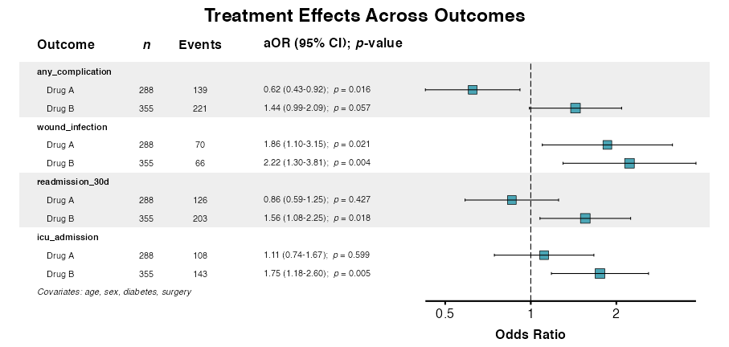
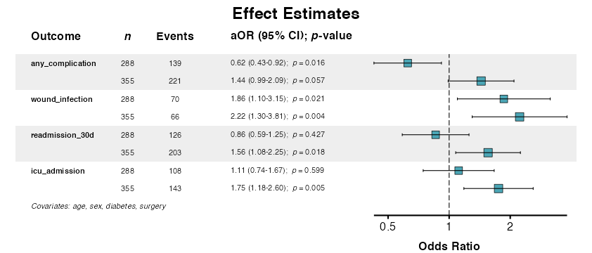
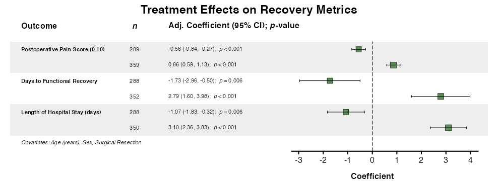
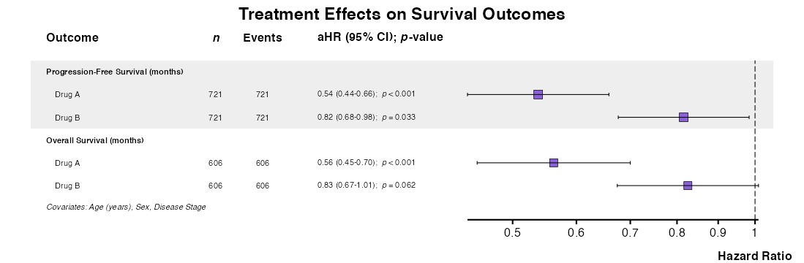
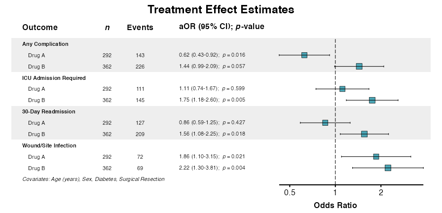

# Multivariate Regression

Multivariate regression refers to the simultaneous examination of a
single independent predictor across multiple dependent variables. This
approach inverts the typical regression paradigm: rather than testing
multiple predictors against one outcome (as in
[`uniscreen()`](https://phmcc.github.io/summata/reference/uniscreen.md),
[`fit()`](https://phmcc.github.io/summata/reference/fit.md), and
[`fullfit()`](https://phmcc.github.io/summata/reference/fullfit.md)),
multivariate regression tests the predictive value of a individual
factor against multiple outcomes, with or without multivariable
adjustment for other independent factors. This design is particularly
useful when a key exposure or intervention must be evaluated against
several endpoints simultaneously.

The
[`multifit()`](https://phmcc.github.io/summata/reference/multifit.md)
function implements this workflow, supporting all model types available
in `summata` with optional covariate adjustment, interaction terms, and
mixed-effects specifications. Results can be visualized using
[`multiforest()`](https://phmcc.github.io/summata/reference/multiforest.md)
and exported using standard table export functions.

As with other `summata` functions, this function adheres to the standard
calling convention:

``` r
multifit(data, outcomes, predictor, covariates, model_type, ...)
```

where `data` is the dataset, `outcomes` is a vector of screened outcome
variables, `predictor` is the predicting variable under examination,
`covariates` is a vector of simultaneous independent predicting
variables (i.e., potential confounders), and `model_type` is the type of
model to be implemented. This vignette demonstrates the various
capabilities of this function using the included sample dataset.

------------------------------------------------------------------------

## Preliminaries

The examples in this vignette use the `clintrial` dataset included with
`summata`:

``` r
library(summata)
library(survival)
library(ggplot2)

data(clintrial)
data(clintrial_labels)
```

The `clintrial` dataset includes multiple outcome types suitable for
multivariate analysis:

| Outcome Type | Variables | Model |
|:---|:---|:---|
| Continuous | `los_days`, `pain_score`, `recovery_days` | `lm` |
| Binary | `any_complication`, `wound_infection`, `readmission_30d`, `icu_admission` | `glm` (binomial) |
| Count (equidispersed) | `fu_count` | `glm` (poisson) |
| Count (overdispersed) | `ae_count` | `negbin` or `quasipoisson` |
| Time-to-event | `Surv(pfs_months, pfs_status)`, `Surv(os_months, os_status)` | `coxph` |

------------------------------------------------------------------------

## Basic Usage

### **Example 1:** Unadjusted Analysis

Test a single predictor against multiple binary outcomes:

``` r
example1 <- multifit(
  data = clintrial,
  outcomes = c("any_complication", "wound_infection",
               "readmission_30d", "icu_admission"),
  predictor = "surgery",
  labels = clintrial_labels,
  parallel = FALSE
)

example1
##> 
##> Multivariate Analysis Results
##> Predictor: surgery
##> Outcomes: 4
##> Model Type: glm
##> Display: unadjusted
##> 
##>                   Outcome          Predictor      n Events      OR (95% CI) p-value
##>                    <char>             <char> <char> <char>           <char>  <char>
##> 1:       Any Complication Surgical Resection    370    236 1.70 (1.29-2.25) < 0.001
##> 2:   Wound/Site Infection Surgical Resection    370    121 4.58 (3.16-6.66) < 0.001
##> 3:     30-Day Readmission Surgical Resection    370    181 0.91 (0.69-1.19)   0.500
##> 4: ICU Admission Required Surgical Resection    370    179 2.25 (1.70-2.99) < 0.001
```

Each row shows the effect of the predictor on a specific outcome. For
categorical predictors, each non-reference level appears separately.

### **Example 2:** Adjusted Analysis

Include covariates for confounding control:

``` r
example2 <- multifit(
  data = clintrial,
  outcomes = c("any_complication", "wound_infection",
               "readmission_30d", "icu_admission"),
  predictor = "surgery",
  covariates = c("age", "sex", "smoking", "diabetes"),
  labels = clintrial_labels,
  parallel = FALSE
)

example2
##> 
##> Multivariate Analysis Results
##> Predictor: surgery
##> Outcomes: 4
##> Model Type: glm
##> Covariates: age, sex, smoking, diabetes
##> Display: adjusted
##> 
##>                   Outcome          Predictor      n Events     aOR (95% CI) p-value
##>                    <char>             <char> <char> <char>           <char>  <char>
##> 1:       Any Complication Surgical Resection    362    229 1.84 (1.38-2.47) < 0.001
##> 2:   Wound/Site Infection Surgical Resection    362    117 5.21 (3.48-7.80) < 0.001
##> 3:     30-Day Readmission Surgical Resection    362    176 1.07 (0.80-1.43)   0.641
##> 4: ICU Admission Required Surgical Resection    362    173 2.56 (1.90-3.46) < 0.001
```

### **Example 3:** Unadjusted and Adjusted Comparison

Use `columns = "both"` to display unadjusted and adjusted results
side-by-side:

``` r
example3 <- multifit(
  data = clintrial,
  outcomes = c("any_complication", "wound_infection",
               "readmission_30d", "icu_admission"),
  predictor = "surgery",
  covariates = c("age", "sex", "diabetes", "surgery"),
  columns = "both",
  labels = clintrial_labels,
  parallel = FALSE
)

example3
##> 
##> Multivariate Analysis Results
##> Predictor: surgery
##> Outcomes: 4
##> Model Type: glm
##> Covariates: age, sex, diabetes, surgery
##> Display: both
##> 
##>                   Outcome          Predictor      n Events      OR (95% CI)   Uni p     aOR (95% CI) Multi p
##>                    <char>             <char> <char> <char>           <char>  <char>           <char>  <char>
##> 1:       Any Complication Surgical Resection    370    236 1.70 (1.29-2.25) < 0.001 1.82 (1.36-2.43) < 0.001
##> 2: ICU Admission Required Surgical Resection    370    179 2.25 (1.70-2.99) < 0.001 2.57 (1.90-3.47) < 0.001
##> 3:     30-Day Readmission Surgical Resection    370    181 0.91 (0.69-1.19)   0.500 1.05 (0.79-1.40)   0.720
##> 4:   Wound/Site Infection Surgical Resection    370    121 4.58 (3.16-6.66) < 0.001 4.98 (3.35-7.40) < 0.001
```

Comparing columns reveals confounding (large differences) or robust
associations (similar estimates).

------------------------------------------------------------------------

## Predictor Types

### **Example 4:** Continuous Predictors

For continuous predictors, one row appears per outcome:

``` r
example4 <- multifit(
  data = clintrial,
  outcomes = c("any_complication", "wound_infection", "icu_admission"),
  predictor = "age",
  covariates = c("sex", "treatment", "surgery"),
  labels = clintrial_labels,
  parallel = FALSE
)

example4
##> 
##> Multivariate Analysis Results
##> Predictor: age
##> Outcomes: 3
##> Model Type: glm
##> Covariates: sex, treatment, surgery
##> Display: adjusted
##> 
##>                   Outcome      n Events     aOR (95% CI) p-value
##>                    <char> <char> <char>           <char>  <char>
##> 1:       Any Complication    850    480 1.01 (1.00-1.03)   0.024
##> 2:   Wound/Site Infection    850    167 1.01 (0.99-1.02)   0.338
##> 3: ICU Admission Required    850    320 1.03 (1.02-1.04) < 0.001
```

The effect estimate represents the change in log-odds per one-unit
increase in the predictor.

### **Example 5:** Multilevel Categorical Predictors

For categorical predictors with multiple levels, the display is
expanded:

``` r
example5 <- multifit(
  data = clintrial,
  outcomes = c("any_complication", "wound_infection",
               "readmission_30d", "icu_admission"),
  predictor = "treatment",
  covariates = c("age", "sex", "surgery"),
  labels = clintrial_labels,
  parallel = FALSE
)

example5
##> 
##> Multivariate Analysis Results
##> Predictor: treatment
##> Outcomes: 4
##> Model Type: glm
##> Covariates: age, sex, surgery
##> Display: adjusted
##> 
##>                   Outcome                Predictor      n Events     aOR (95% CI) p-value
##>                    <char>                   <char> <char> <char>           <char>  <char>
##> 1:       Any Complication Treatment Group (Drug A)    292    143 0.66 (0.45-0.96)   0.031
##> 2:       Any Complication Treatment Group (Drug B)    362    226 1.48 (1.03-2.14)   0.035
##> 3:   Wound/Site Infection Treatment Group (Drug A)    292     72 1.90 (1.14-3.17)   0.013
##> 4:   Wound/Site Infection Treatment Group (Drug B)    362     69 2.26 (1.34-3.79)   0.002
##> 5:     30-Day Readmission Treatment Group (Drug A)    292    127 0.86 (0.59-1.24)   0.415
##> 6:     30-Day Readmission Treatment Group (Drug B)    362    209 1.61 (1.12-2.31)   0.010
##> 7: ICU Admission Required Treatment Group (Drug A)    292    111 1.11 (0.74-1.65)   0.615
##> 8: ICU Admission Required Treatment Group (Drug B)    362    145 1.70 (1.16-2.50)   0.007
```

------------------------------------------------------------------------

## Model Types

### **Example 6:** Cox Regression

For time-to-event outcomes, use `model_type = "coxph"`:

``` r
example6 <- multifit(
  data = clintrial,
  outcomes = c("Surv(pfs_months, pfs_status)",
               "Surv(os_months, os_status)"),
  predictor = "treatment",
  covariates = c("age", "sex", "stage"),
  model_type = "coxph",
  labels = clintrial_labels,
  parallel = FALSE
)

example6
##> 
##> Multivariate Analysis Results
##> Predictor: treatment
##> Outcomes: 2
##> Model Type: coxph
##> Covariates: age, sex, stage
##> Display: adjusted
##> 
##>                               Outcome                Predictor      n Events     aHR (95% CI) p-value
##>                                <char>                   <char> <char> <char>           <char>  <char>
##> 1: Progression-Free Survival (months) Treatment Group (Drug A)    721    721 0.54 (0.44-0.66) < 0.001
##> 2: Progression-Free Survival (months) Treatment Group (Drug B)    721    721 0.82 (0.68-0.98)   0.033
##> 3:          Overall Survival (months) Treatment Group (Drug A)    606    606 0.56 (0.45-0.70) < 0.001
##> 4:          Overall Survival (months) Treatment Group (Drug B)    606    606 0.83 (0.67-1.01)   0.062
```

### **Example 7:** Linear Regression

For continuous outcomes, use `model_type = "lm"`:

``` r
example7 <- multifit(
  data = clintrial,
  outcomes = c("los_days", "pain_score", "recovery_days"),
  predictor = "treatment",
  covariates = c("age", "sex", "surgery"),
  model_type = "lm",
  labels = clintrial_labels,
  parallel = FALSE
)

example7
##> 
##> Multivariate Analysis Results
##> Predictor: treatment
##> Outcomes: 3
##> Model Type: lm
##> Covariates: age, sex, surgery
##> Display: adjusted
##> 
##>                            Outcome                Predictor      n Adj. Coefficient (95% CI) p-value
##>                             <char>                   <char> <char>                    <char>  <char>
##> 1:  Length of Hospital Stay (days) Treatment Group (Drug A)    288    -1.07 (-1.83 to -0.32)   0.006
##> 2:  Length of Hospital Stay (days) Treatment Group (Drug B)    350       3.10 (2.36 to 3.83) < 0.001
##> 3: Postoperative Pain Score (0-10) Treatment Group (Drug A)    289    -0.56 (-0.84 to -0.27) < 0.001
##> 4: Postoperative Pain Score (0-10) Treatment Group (Drug B)    359       0.86 (0.59 to 1.13) < 0.001
##> 5:     Days to Functional Recovery Treatment Group (Drug A)    288    -1.73 (-2.96 to -0.50)   0.006
##> 6:     Days to Functional Recovery Treatment Group (Drug B)    352       2.79 (1.60 to 3.98) < 0.001
```

### **Example 8:** Mixed-Effects Models

Account for clustering using random effects:

``` r
example8 <- multifit(
  data = clintrial,
  outcomes = c("any_complication", "wound_infection"),
  predictor = "treatment",
  covariates = c("age", "sex"),
  random = "(1|site)",
  model_type = "glmer",
  labels = clintrial_labels,
  parallel = FALSE
)

example8
##> 
##> Multivariate Analysis Results
##> Predictor: treatment
##> Outcomes: 2
##> Model Type: glmer
##> Covariates: age, sex
##> Random Effects: (1|site)
##> Display: adjusted
##> 
##>                 Outcome                Predictor      n Events     aOR (95% CI) p-value
##>                  <char>                   <char> <char> <char>           <char>  <char>
##> 1:     Any Complication Treatment Group (Drug A)    292    143 0.74 (0.51-1.06)   0.104
##> 2:     Any Complication Treatment Group (Drug B)    362    226 1.29 (0.90-1.84)   0.170
##> 3: Wound/Site Infection Treatment Group (Drug A)    292     72 2.17 (1.32-3.57)   0.002
##> 4: Wound/Site Infection Treatment Group (Drug B)    362     69 1.62 (0.99-2.66)   0.055
```

------------------------------------------------------------------------

## Advanced Features

### **Example 9:** Interaction Terms

Interaction terms can be added to test effect modification:

``` r
example9 <- multifit(
  data = clintrial,
  outcomes = c("any_complication", "wound_infection"),
  predictor = "treatment",
  covariates = c("age", "sex"),
  interactions = c("treatment:sex"),
  labels = clintrial_labels,
  parallel = FALSE
)

example9
##> 
##> Multivariate Analysis Results
##> Predictor: treatment
##> Outcomes: 2
##> Model Type: glm
##> Covariates: age, sex
##> Interactions: treatment:sex
##> Display: adjusted
##> 
##>                 Outcome                             Predictor      n Events     aOR (95% CI) p-value
##>                  <char>                                <char> <char> <char>           <char>  <char>
##> 1:     Any Complication              Treatment Group (Drug A)    292    143 0.63 (0.38-1.04)   0.074
##> 2:     Any Complication              Treatment Group (Drug B)    362    226 1.27 (0.78-2.08)   0.340
##> 3:     Any Complication Treatment Group (Drug A) × Sex (Male)      -      - 1.41 (0.68-2.93)   0.360
##> 4:     Any Complication Treatment Group (Drug B) × Sex (Male)      -      - 0.99 (0.48-2.00)   0.968
##> 5: Wound/Site Infection              Treatment Group (Drug A)    292     72 2.20 (1.13-4.28)   0.020
##> 6: Wound/Site Infection              Treatment Group (Drug B)    362     69 1.30 (0.66-2.57)   0.455
##> 7: Wound/Site Infection Treatment Group (Drug A) × Sex (Male)      -      - 0.93 (0.35-2.50)   0.884
##> 8: Wound/Site Infection Treatment Group (Drug B) × Sex (Male)      -      - 1.43 (0.54-3.83)   0.472
```

### **Example 10:** Filtering by p-value

Outputs can be filtered to retain only significant associations:

``` r
example10 <- multifit(
  data = clintrial,
  outcomes = c("any_complication", "wound_infection",
               "readmission_30d", "icu_admission"),
  predictor = "treatment",
  covariates = c("age", "sex", "surgery"),
  p_threshold = 0.01,
  labels = clintrial_labels,
  parallel = FALSE
)

example10
##> 
##> Multivariate Analysis Results
##> Predictor: treatment
##> Outcomes: 4
##> Model Type: glm
##> Covariates: age, sex, surgery
##> Display: adjusted
##> 
##>                   Outcome                Predictor      n Events     aOR (95% CI) p-value
##>                    <char>                   <char> <char> <char>           <char>  <char>
##> 1:   Wound/Site Infection Treatment Group (Drug B)    362     69 2.26 (1.34-3.79)   0.002
##> 2:     30-Day Readmission Treatment Group (Drug B)    362    209 1.61 (1.12-2.31)   0.010
##> 3: ICU Admission Required Treatment Group (Drug B)    362    145 1.70 (1.16-2.50)   0.007
```

### **Example 11:** Accessing Model Objects

Underlying model objects are stored as attributes for additional
analysis:

``` r
result <- multifit(
  data = clintrial,
  outcomes = c("any_complication", "wound_infection"),
  predictor = "treatment",
  covariates = c("age", "sex"),
  labels = clintrial_labels,
  keep_models = TRUE,
  parallel = FALSE
)

# Access individual models
models <- attr(result, "models")
names(models)
##> [1] "any_complication" "wound_infection"

# Examine a specific model
summary(models[["any_complication"]])
##>          Length Class Mode
##> adjusted 30     glm   list
```

------------------------------------------------------------------------

## Forest Plot Visualization

The
[`multiforest()`](https://phmcc.github.io/summata/reference/multiforest.md)
function creates forest plots from
[`multifit()`](https://phmcc.github.io/summata/reference/multifit.md)
results.

### **Example 12:** Forest Plot for Logistic (Binary) Outcomes

Results from
[`multifit()`](https://phmcc.github.io/summata/reference/multifit.md)
can be directly inserted into the
[`multiforest()`](https://phmcc.github.io/summata/reference/multiforest.md)
function to generate a forest plot:

``` r
result <- multifit(
  data = clintrial,
  outcomes = c("any_complication", "wound_infection",
               "readmission_30d", "icu_admission"),
  predictor = "treatment",
  covariates = c("age", "sex", "diabetes", "surgery"),
  labels = clintrial_labels,
  parallel = FALSE
)

example12 <- multiforest(
  result,
  title = "Treatment Effects Across Outcomes",
  indent_predictor = TRUE,
  zebra_stripes = TRUE
)
```



### **Example 13:** Customization Options

Customize the appearance of the forest plot by adjusting function
parameters:

``` r
example13 <- multiforest(
  result,
  title = "Effect Estimates",
  column = "adjusted",
  show_predictor = FALSE,
  covariates_footer = TRUE,
  table_width = 0.65,
  color = "#4BA6B6"
)
```



### **Example 14:** Forest Plot for Continuous Outcomes

Create forest plots for continuous outcomes:

``` r
lm_result <- multifit(
  data = clintrial,
  outcomes = c("pain_score", "recovery_days", "los_days"),
  predictor = "treatment",
  covariates = c("age", "sex", "surgery"),
  model_type = "lm",
  parallel = FALSE
)

example14 <- multiforest(
  lm_result,
  title = "Treatment Effects on Recovery Metrics",
  show_predictor = FALSE,
  covariates_footer = TRUE,
  labels = clintrial_labels
)
```



### **Example 15:** Forest Plot for Survival Outcomes

The
[`multiforest()`](https://phmcc.github.io/summata/reference/multiforest.md)
function supports multiple `model_type` outputs from
[`multifit()`](https://phmcc.github.io/summata/reference/multifit.md).
In addition, variable labels can be applied to
[`multiforest()`](https://phmcc.github.io/summata/reference/multiforest.md)
outputs similarly to other forest plot functions:

``` r
cox_result <- multifit(
  data = clintrial,
  outcomes = c("Surv(pfs_months, pfs_status)",
               "Surv(os_months, os_status)"),
  predictor = "treatment",
  covariates = c("age", "sex", "stage"),
  model_type = "coxph",
  parallel = FALSE
)

example15 <- multiforest(
  cox_result,
  title = "Treatment Effects on Survival Outcomes",
  indent_predictor = TRUE,
  zebra_stripes = TRUE,
  labels = clintrial_labels
)
```



------------------------------------------------------------------------

## Exporting Results

### Tables

Export tables using standard export functions:

``` r
table2docx(
  table = result,
  file = "multioutcome_analysis.docx",
  caption = "Treatment Effects Across Outcomes"
)

table2pdf(
  table = result,
  file = "multioutcome_analysis.pdf",
  caption = "Treatment Effects Across Outcomes"
)
```

### Forest Plots

Save forest plots using
[`ggsave()`](https://ggplot2.tidyverse.org/reference/ggsave.html):

``` r
p <- multiforest(result, title = "Effect Estimates")
dims <- attr(p, "rec_dims")

ggsave("multioutcome_forest.pdf", p,
       width = attr(result, "rec_dims")$width,
       height = attr(result, "rec_dims")$height, 
       units = "in")
```

------------------------------------------------------------------------

### Complete Workflow Example

The following demonstrates a complete multi-outcome analysis workflow:

``` r
## Define outcomes by type
binary_outcomes <- c("any_complication", "wound_infection",
                     "readmission_30d", "icu_admission")
survival_outcomes <- c("Surv(pfs_months, pfs_status)",
                       "Surv(os_months, os_status)")

## Unadjusted screening
unadjusted <- multifit(
  data = clintrial,
  outcomes = binary_outcomes,
  predictor = "treatment",
  labels = clintrial_labels,
  parallel = FALSE
)

unadjusted
##> 
##> Multivariate Analysis Results
##> Predictor: treatment
##> Outcomes: 4
##> Model Type: glm
##> Display: unadjusted
##> 
##>                   Outcome                Predictor      n Events      OR (95% CI) p-value
##>                    <char>                   <char> <char> <char>           <char>  <char>
##> 1:       Any Complication Treatment Group (Drug A)    292    143 0.73 (0.51-1.06)   0.097
##> 2:       Any Complication Treatment Group (Drug B)    362    226 1.27 (0.89-1.81)   0.182
##> 3:   Wound/Site Infection Treatment Group (Drug A)    292     72 2.14 (1.31-3.50)   0.002
##> 4:   Wound/Site Infection Treatment Group (Drug B)    362     69 1.54 (0.94-2.51)   0.084
##> 5:     30-Day Readmission Treatment Group (Drug A)    292    127 0.89 (0.62-1.28)   0.523
##> 6:     30-Day Readmission Treatment Group (Drug B)    362    209 1.58 (1.11-2.24)   0.011
##> 7: ICU Admission Required Treatment Group (Drug A)    292    111 1.26 (0.86-1.85)   0.226
##> 8: ICU Admission Required Treatment Group (Drug B)    362    145 1.38 (0.96-1.99)   0.085

## Adjusted analysis with comparison
adjusted <- multifit(
  data = clintrial,
  outcomes = binary_outcomes,
  predictor = "treatment",
  covariates = c("age", "sex", "diabetes", "surgery"),
  columns = "both",
  labels = clintrial_labels,
  parallel = FALSE
)

adjusted
##> 
##> Multivariate Analysis Results
##> Predictor: treatment
##> Outcomes: 4
##> Model Type: glm
##> Covariates: age, sex, diabetes, surgery
##> Display: both
##> 
##>                   Outcome                Predictor      n Events      OR (95% CI)  Uni p     aOR (95% CI) Multi p
##>                    <char>                   <char> <char> <char>           <char> <char>           <char>  <char>
##> 1:       Any Complication Treatment Group (Drug A)    292    143 0.73 (0.51-1.06)  0.097 0.62 (0.43-0.92)   0.016
##> 2:       Any Complication Treatment Group (Drug B)    362    226 1.27 (0.89-1.81)  0.182 1.44 (0.99-2.09)   0.057
##> 3: ICU Admission Required Treatment Group (Drug A)    292    111 1.26 (0.86-1.85)  0.226 1.11 (0.74-1.67)   0.599
##> 4: ICU Admission Required Treatment Group (Drug B)    362    145 1.38 (0.96-1.99)  0.085 1.75 (1.18-2.60)   0.005
##> 5:     30-Day Readmission Treatment Group (Drug A)    292    127 0.89 (0.62-1.28)  0.523 0.86 (0.59-1.25)   0.427
##> 6:     30-Day Readmission Treatment Group (Drug B)    362    209 1.58 (1.11-2.24)  0.011 1.56 (1.08-2.25)   0.018
##> 7:   Wound/Site Infection Treatment Group (Drug A)    292     72 2.14 (1.31-3.50)  0.002 1.86 (1.10-3.15)   0.021
##> 8:   Wound/Site Infection Treatment Group (Drug B)    362     69 1.54 (0.94-2.51)  0.084 2.22 (1.30-3.81)   0.004

## Forest plot visualization
forest_plot <- multiforest(
  adjusted,
  title = "Treatment Effect Estimates",
  column = "adjusted",
  indent_predictor = TRUE,
  zebra_stripes = TRUE,
  table_width = 0.65,
  labels = clintrial_labels
)
```



------------------------------------------------------------------------

### Parameter Reference

| Parameter      | Description                                                |
|:---------------|:-----------------------------------------------------------|
| `outcomes`     | Character vector of outcome variable names                 |
| `predictor`    | Single predictor variable name                             |
| `covariates`   | Optional adjustment covariates                             |
| `interactions` | Interaction terms (colon notation)                         |
| `random`       | Random effects formula for mixed models                    |
| `strata`       | Stratification variable (Cox models)                       |
| `cluster`      | Clustering variable for robust standard errors             |
| `model_type`   | `"glm"`, `"lm"`, `"coxph"`, `"glmer"`, `"lmer"`, `"coxme"` |
| `family`       | GLM family (default: `"binomial"`)                         |
| `columns`      | `"adjusted"`, `"unadjusted"`, or `"both"`                  |
| `p_threshold`  | Filter results by *p*-value                                |
| `labels`       | Custom variable labels                                     |
| `parallel`     | Enable parallel processing                                 |

------------------------------------------------------------------------

## Best Practices

### Outcome Selection

1.  Use compatible outcome types within a single analysis
2.  Group conceptually related outcomes
3.  Consider multiple testing adjustments when testing many outcomes

### Adjustment Strategy

1.  Pre-specify covariates based on domain knowledge
2.  Use `columns = "both"` to assess confounding
3.  Apply consistent covariates across outcomes for comparability

### Interpretation

1.  Focus on effect magnitude and precision, not only *p*-values
2.  Look for consistent patterns across related outcomes
3.  Consider practical significance alongside statistical significance

------------------------------------------------------------------------

## Common Issues

### Empty Results

If results are empty, verify:

- Predictor variable exists and has variation
- Outcomes are correctly specified
  ([`Surv()`](https://rdrr.io/pkg/survival/man/Surv.html) syntax for
  survival)
- Model type matches outcome type

### Convergence Warnings

For mixed-effects models, simplify the random effects structure:

``` r
## Start with random intercepts only
multifit(data, outcomes, predictor,
         random = "(1|site)",
         model_type = "glmer")
```

### Many Factor Levels

For predictors with many levels, consider collapsing categories:

``` r
clintrial$treatment_binary <- ifelse(clintrial$treatment == "Control", 
                                      "Control", "Active")
```

------------------------------------------------------------------------

## Other Considerations

### Multivariate vs. Univariable Screening

The distinction between
[`multifit()`](https://phmcc.github.io/summata/reference/multifit.md)
and
[`uniscreen()`](https://phmcc.github.io/summata/reference/uniscreen.md)
is important:

| Function | Tests | Use Case |
|:---|:---|:---|
| [`uniscreen()`](https://phmcc.github.io/summata/reference/uniscreen.md) | Multiple predictors → One outcome | Variable screening, risk factor identification |
| [`multifit()`](https://phmcc.github.io/summata/reference/multifit.md) | One predictor → Multiple outcomes | Exposure effects, intervention evaluation |

All outcomes in a single
[`multifit()`](https://phmcc.github.io/summata/reference/multifit.md)
call should be of the same type (all binary, all continuous, or all
survival). Mixing outcome types produces tables with incompatible effect
measures. The function validates outcome compatibility and issues a
warning when mixed types are detected.

### Categorical Outcomes with More Than Two Levels

[`multifit()`](https://phmcc.github.io/summata/reference/multifit.md)
supports binary outcomes (via logistic regression) but not multinomial
or ordinal outcomes. If a categorical outcome with three or more levels
is included (e.g., treatment group with “Control”, “Drug A”, “Drug B”),
the function will issue a warning because binomial GLM coerces such
variables to binary (first level *vs.* all others).

For multilevel categorical outcomes, use dedicated packages outside of
`summata`:

``` r
## Multinomial regression (unordered categories)
library(nnet)
model <- multinom(treatment ~ age + sex + stage, data = clintrial)

## Ordinal regression (ordered categories)
library(MASS)
model <- polr(grade ~ age + sex + stage, data = clintrial, Hess = TRUE)
```

------------------------------------------------------------------------

### Further Reading

- [Descriptive
  Tables](https://phmcc.github.io/summata/articles/descriptive_tables.md):
  [`desctable()`](https://phmcc.github.io/summata/reference/desctable.md)
  for baseline characteristics
- [Regression
  Modeling](https://phmcc.github.io/summata/articles/regression_modeling.md):
  [`fit()`](https://phmcc.github.io/summata/reference/fit.md),
  [`uniscreen()`](https://phmcc.github.io/summata/reference/uniscreen.md),
  and
  [`fullfit()`](https://phmcc.github.io/summata/reference/fullfit.md)
- [Model
  Comparison](https://phmcc.github.io/summata/articles/model_comparison.md):
  [`compfit()`](https://phmcc.github.io/summata/reference/compfit.md)
  for comparing models
- [Table
  Export](https://phmcc.github.io/summata/articles/table_export.md):
  Export to PDF, Word, and other formats
- [Forest
  Plots](https://phmcc.github.io/summata/articles/forest_plots.md):
  Visualization of regression results
- [Advanced
  Workflows](https://phmcc.github.io/summata/articles/advanced_workflows.md):
  Interactions and mixed-effects models
