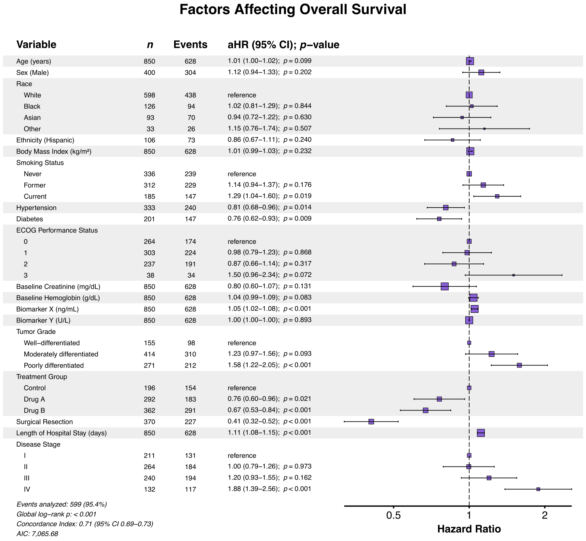
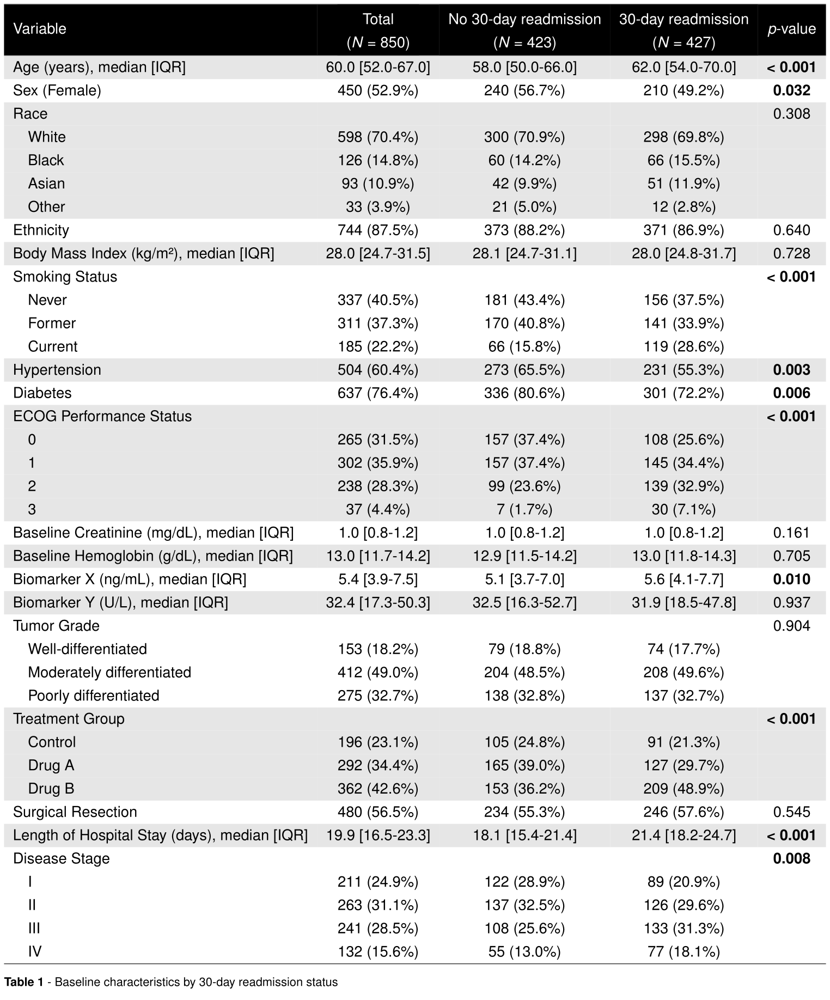
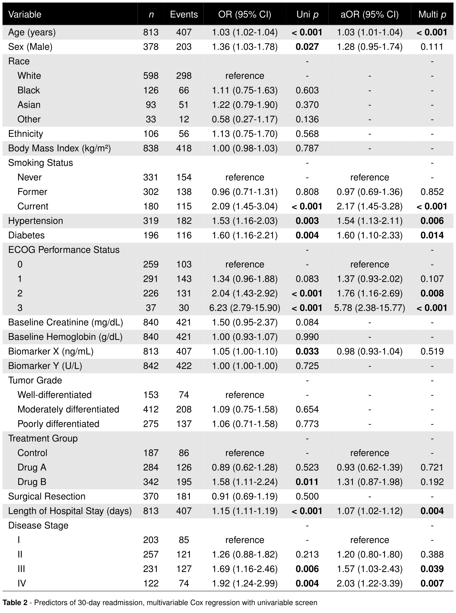
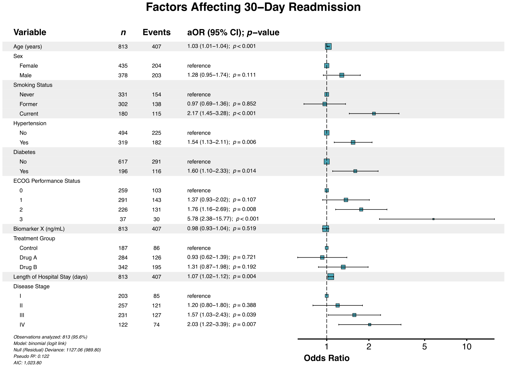

# summata [](https://phmcc.github.io/summata/)

> ***summata*** \| /suːˈmɑːtə/ \| *Latin, n. pl. of* summātum*,
> gerundive of* summāre*: those that have been summarized*
>
> Complete, publication-ready statistical summaries.

## Overview

The `summata` package provides a comprehensive framework for generating
summary tables and visualizations from statistical analyses. Built on
`data.table` for computational efficiency, it streamlines the workflow
from descriptive statistics, through regression modeling, to final
output—all using a unified interface with standardized,
presentation-ready results.

For a more comprehensive description of this package and its features,
see the [full documentation and
vignettes](https://phmcc.github.io/summata/).



## Installation

The stable release of this package can be installed from CRAN.

``` r
install.packages("summata")
```

Alternatively, install it directly from GitHub (stable) or Codeberg
(development):

``` r
# Stable release
devtools::install_github("phmcc/summata")

# Development version
devtools::install_git("https://codeberg.org/phmcc/summata.git")
```

## Package Composition

### Design Principles

The architecture of `summata` reflects three guiding principles:

1.  **Consistent syntax.** All modeling functions share a common
    signature: data first, followed by the outcome or variable of
    interest, then constituent/modifying variables. This convention
    facilitates both pipe-based workflows and pedagogical clarity.

2.  **Transparent computation.** Functions attach their underlying model
    objects and raw numerical results as attributes, permitting
    verification of computations or extension of analyses beyond the
    formatted output.

3.  **Separation of concerns.** Analysis, formatting, and export
    constitute distinct operations, allowing each stage to be modified
    independently.

These principles manifest in the standard calling convention:

``` r
result <- fit(data, variable, c("var1", "var2", ..., "varN"), ...)
```

where `data` is the dataset, `variable` is the variable of interest
(dependent variable, endpoint/outcome, stratification/grouping variable,
*etc.*), and `c("var1", "var2", ..., "varN")`is a vector of
constituent/modifying variables (independent variables, model
covariates, compared/explanatory factors, *etc.*). The result is a
formatted table for export, with readily accessible attributes for
further analysis.

``` r
# The formatted table
print(result)

# The underlying model object
model <- attr(result, "model")

# Raw numerical results
raw <- attr(result, "raw_data")
```

### Functional Reference

This package provides a variety of functions for different stages of
statistical analysis:

#### Descriptive analysis

Tables to provide quick summary data and comparison tests between
different groups.

| Function | Purpose |
|:---|:---|
| [`desctable()`](https://phmcc.github.io/summata/reference/desctable.md) | Descriptive statistics with stratification and hypothesis testing |
| [`survtable()`](https://phmcc.github.io/summata/reference/survtable.md) | Survival probability estimates at specified time points |

#### Predictive analysis

Fitted univariable and multivariable regression results for predictive
modeling.

| Function | Purpose |
|:---|:---|
| [`uniscreen()`](https://phmcc.github.io/summata/reference/uniscreen.md) | Systematic univariable analysis across multiple predictors |
| [`fit()`](https://phmcc.github.io/summata/reference/fit.md) | Single regression model with formatted coefficient extraction |
| [`fullfit()`](https://phmcc.github.io/summata/reference/fullfit.md) | Integrated univariable screening with multivariable regression |
| [`compfit()`](https://phmcc.github.io/summata/reference/compfit.md) | Nested model comparison with composite scoring |
| [`multifit()`](https://phmcc.github.io/summata/reference/multifit.md) | Multivariate regression analysis with a single predictor evaluated against multiple outcomes |

#### Table export

Export of finalized tables to various commonly used formats.

| Function | Format | Dependencies |
|:---|:---|:---|
| [`autotable()`](https://phmcc.github.io/summata/reference/autotable.md) | Auto-detect from file extension | Varies |
| [`table2pdf()`](https://phmcc.github.io/summata/reference/table2pdf.md) | PDF | `xtable`, LaTeX distribution |
| [`table2tex()`](https://phmcc.github.io/summata/reference/table2tex.md) | LaTeX source | `xtable` |
| [`table2html()`](https://phmcc.github.io/summata/reference/table2html.md) | HTML | `xtable` |
| [`table2docx()`](https://phmcc.github.io/summata/reference/table2docx.md) | Microsoft Word | `officer`, `flextable` |
| [`table2pptx()`](https://phmcc.github.io/summata/reference/table2pptx.md) | Microsoft PowerPoint | `officer`, `flextable` |
| [`table2rtf()`](https://phmcc.github.io/summata/reference/table2rtf.md) | Rich Text Format | `officer`, `flextable` |

#### Data visualization

Generation of publication-ready forest plot graphics to summarize
regression models.

| Function | Application |
|:---|:---|
| [`autoforest()`](https://phmcc.github.io/summata/reference/autoforest.md) | Automatic model class detection |
| [`lmforest()`](https://phmcc.github.io/summata/reference/lmforest.md) | Linear models |
| [`glmforest()`](https://phmcc.github.io/summata/reference/glmforest.md) | Generalized linear models |
| [`coxforest()`](https://phmcc.github.io/summata/reference/coxforest.md) | Proportional hazards models |
| [`uniforest()`](https://phmcc.github.io/summata/reference/uniforest.md) | Univariable screening results |
| [`multiforest()`](https://phmcc.github.io/summata/reference/multiforest.md) | Multivariate regression analysis results |

### Supported Model Classes

The following regression models are currently supported by `summata`.
Specify the model using the `model_type` parameter in the appropriate
regression function
([`uniscreen()`](https://phmcc.github.io/summata/reference/uniscreen.md),
[`fit()`](https://phmcc.github.io/summata/reference/fit.md),
[`fullfit()`](https://phmcc.github.io/summata/reference/fullfit.md),
[`compfit()`](https://phmcc.github.io/summata/reference/compfit.md), or
[`multifit()`](https://phmcc.github.io/summata/reference/multifit.md)):

| Model Class | `model_type` | Function | Effect Measure |
|:---|:---|:---|:---|
| Linear regression | `lm` | [`stats::lm()`](https://rdrr.io/r/stats/lm.html) | *β* coefficient |
| Logistic regression | `glm`, `family = "binomial"` | [`stats::glm()`](https://rdrr.io/r/stats/glm.html) | Odds ratio |
| Logistic (overdispersed) | `glm`, `family = "quasibinomial"` | [`stats::glm()`](https://rdrr.io/r/stats/glm.html) | Odds ratio |
| Poisson regression | `glm`, `family = "poisson"` | [`stats::glm()`](https://rdrr.io/r/stats/glm.html) | Rate ratio |
| Poisson (overdispersed) | `glm`, `family = "quasipoisson"` | [`stats::glm()`](https://rdrr.io/r/stats/glm.html) | Rate ratio |
| Gaussian (via GLM) | `glm`, `family = "gaussian"` | [`stats::glm()`](https://rdrr.io/r/stats/glm.html) | *β* coefficient |
| Gamma regression | `glm`, `family = "Gamma"` | [`stats::glm()`](https://rdrr.io/r/stats/glm.html) | Ratio\* |
| Inverse Gaussian | `glm`, `family = "inverse.gaussian"` | [`stats::glm()`](https://rdrr.io/r/stats/glm.html) | Ratio\* |
| Cox proportional hazards | `coxph` | [`survival::coxph()`](https://rdrr.io/pkg/survival/man/coxph.html) | Hazard ratio |
| Conditional logistic | `clogit` | [`survival::clogit()`](https://rdrr.io/pkg/survival/man/clogit.html) | Odds ratio |
| Negative binomial | `negbin` | [`MASS::glm.nb()`](https://rdrr.io/pkg/MASS/man/glm.nb.html) | Rate ratio |
| Linear mixed effects | `lmer` | [`lme4::lmer()`](https://rdrr.io/pkg/lme4/man/lmer.html) | *β* coefficient |
| Generalized linear mixed effects | `glmer` | [`lme4::glmer()`](https://rdrr.io/pkg/lme4/man/glmer.html) | Odds/rate ratio |
| Cox mixed effects | `coxme` | [`coxme::coxme()`](https://rdrr.io/pkg/coxme/man/coxme.html) | Hazard ratio |

\*with log link; coefficient with identity link

## Comparison with Related Packages

The R ecosystem includes several established packages for regression
table generation. The following comparison identifies areas of overlap
and distinction:

| Capability                       | summata | gtsummary | finalfit | arsenal |
|:---------------------------------|:-------:|:---------:|:--------:|:-------:|
| Descriptive statistics           |    ✓    |     ✓     |    ✓     |    ✓    |
| Survival summaries               |    ✓    |     ✓     |    ◐     |    —    |
| Univariable screening            |    ✓    |     ✓     |    ✓     |    ✓    |
| Multivariable regression         |    ✓    |     ✓     |    ✓     |    ✓    |
| Multi-format export              |    ✓    |     ✓     |    ✓     |    ✓    |
| Integrated forest plots          |    ✓    |     ◐     |    ✓     |    —    |
| Model comparison                 |    ✓    |     ✓     |    ◐     |    —    |
| Mixed-effects models             |    ✓    |     ◐     |    ◐     |    —    |
| Multivariate regression analysis |    ✓    |     —     |    —     |    —    |

_(✓ Full support \| ◐ Partial support \| — Not available)

A detailed feature comparison is available in the [package
documentation](https://phmcc.github.io/summata/articles/feature_comparison.html).

## Illustrative Example

The `clintrial` dataset included with this package provides simulated
clinical trial data comprising patient identifiers, baseline
characteristics, therapeutic interventions, short-term outcomes, and
long-term survival statistics. The following example demonstrates how
`summata` functions can be used to analyze perioperative factors
affecting 30-day hospital readmission.

### **Step 0:** Data Preparation

Prior to analysis, load the dataset, apply labels, and define
predictors:

``` r
library(summata)

# Load example data
data("clintrial")
data("clintrial_labels")

# Define candidate predictors
predictors <- c("age", "sex", "race", "ethnicity", "bmi", "smoking",
                "hypertension", "diabetes", "ecog", "creatinine",
                "hemoglobin", "biomarker_x", "biomarker_y", "grade",
                "treatment", "surgery", "los_days", "stage")
```

### **Step 1:** Descriptive Statistics

Use the
[`desctable()`](https://phmcc.github.io/summata/reference/desctable.md)
function to generate summary statistics with stratification by a
grouping variable (in this case, 30-day readmission):

``` r
table1 <- desctable(
    data = clintrial,
    by = "readmission_30d",
    variables = predictors,
    labels = clintrial_labels
)

table2pdf(table1, "table1.pdf",
          caption = "\\textbf{Table 1} - Baseline characteristics by 30-day readmission status",
          paper = "auto",
          condense_table = TRUE,
          dark_header = TRUE,
          zebra_stripes = TRUE
)
```



### **Step 2:** Regression Analysis

Perform an integrated univariable-to-multivariable regression workflow
using the
[`fullfit()`](https://phmcc.github.io/summata/reference/fullfit.md)
function:

``` r
table2 <- fullfit(
    data = clintrial,
    outcome = "readmission_30d",
    predictors = predictors,
    method = "screen",
    p_threshold = 0.05,
    model_type = "glm",
    labels = clintrial_labels
)

table2pdf(table2, "table2.pdf",
          caption = "\\textbf{Table 2} - Predictors of 30-day readmission, multivariable Cox regression with univariable screen",
          paper = "auto",
          condense_table = TRUE,
          dark_header = TRUE,
          zebra_stripes = TRUE
)
```



### **Step 3:** Forest Plot

Finally, generate a forest plot to provide a graphical representation of
effect estimates using the
[`glmforest()`](https://phmcc.github.io/summata/reference/glmforest.md)
function:

``` r
forest_30d <- glmforest(table2,
                        title = "Factors Affecting 30-Day Readmission",
                        labels = clintrial_labels,
                        indent_groups = TRUE
                        )

ggsave("forest_30d.pdf", forest_30d,
       width = attr(forest_30d, "rec_dims")$width,
       height = attr(forest_30d, "rec_dims")$height, 
       units = "in")
```



## Development

### Repository

- **Primary development**:
  [codeberg.org/phmcc/summata](https://codeberg.org/phmcc/summata)
- **GitHub releases**:
  [github.com/phmcc/summata](https://github.com/phmcc/summata)

### Contributing

Bug reports and feature requests may be submitted via the [issue
tracker](https://github.com/phmcc/summata/issues). Contributions are
welcome; please consult the contributing guidelines prior to submitting
pull requests.

## Acknowledgments

The design of `summata` draws inspiration from several existing
packages:

- **finalfit** (Harrison) — Regression workflow concepts  
- **gtsummary** (Sjoberg et al.) — Table generation architecture  
- **arsenal** (Heinzen et al.) — Descriptive statistics methodology  
- **data.table** (Dowle & Srinivasan) — High-performance data operations

## License

GPL (\>= 3.0)

## Citation

``` r
citation("summata")

To cite summata in publications, use:

  McClelland PH (2026). _summata: Publication-Ready Summary Tables and Forest Plots_. R package version 0.11.4, <https://phmcc.github.io/summata/>.

A BibTeX entry for LaTeX users is

  @Manual{,
    title = {summata: Publication-Ready Summary Tables and Forest Plots},
    author = {Paul Hsin-ti McClelland},
    year = {2026},
    note = {R package version 0.11.4},
    url = {https://phmcc.github.io/summata/},
  }
```

## Further Resources

- **Function documentation**: `?function_name` or the [reference
  index](https://phmcc.github.io/summata/reference/index.html)
- **Vignettes**: `vignette("summata")` or [online
  articles](https://phmcc.github.io/summata/articles/index.html)
- **Issue tracker**: [Codeberg
  Issues](https://codeberg.org/phmcc/summata/issues), [GitHub
  Issues](https://github.com/phmcc/summata/issues)

------------------------------------------------------------------------

_(The `summata` package is under active development.)
