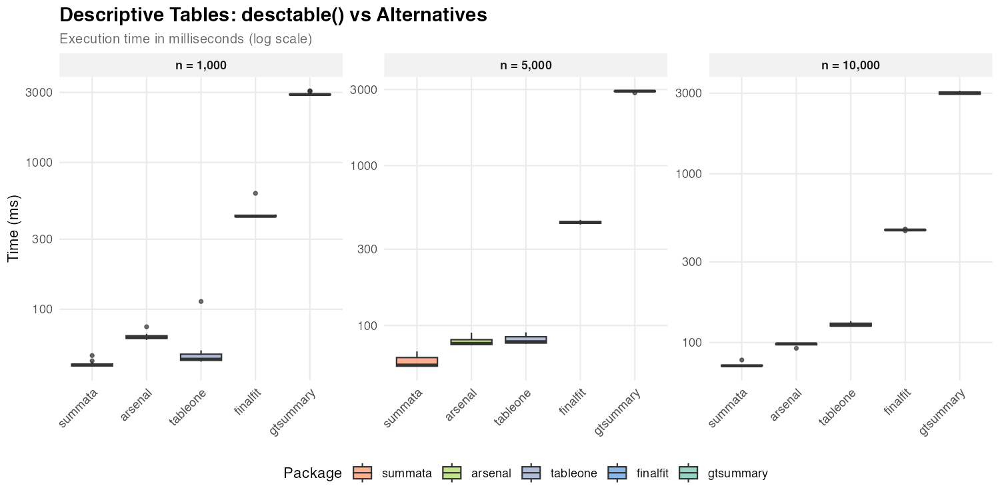
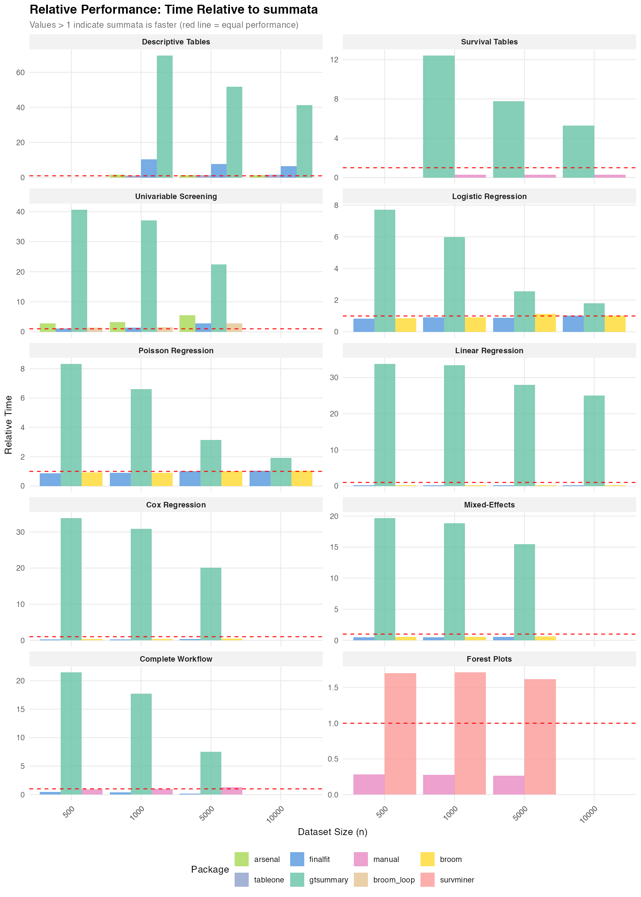

```{r, include = FALSE}
knitr::opts_chunk$set(
  collapse = TRUE,
  comment = "#>",
  message = FALSE,
  warning = FALSE,
  eval = TRUE
)
```

Execution speed is rarely the primary consideration when selecting statistical software—correctness, interpretability, and ease of use typically take precedence. However, computational efficiency becomes relevant when working with large datasets, conducting simulation studies, or iterating through model specifications during exploratory analysis.

This article documents the computational performance of `summata` relative to established alternatives. The benchmarks presented here are intended as a reference for users whose workflows involve performance-sensitive operations, and as a record of the design tradeoffs inherent in different implementation approaches.

---

# Methodology

All benchmarks were conducted using the `microbenchmark` package under the following conditions:

- **Iterations**: 5–20 per benchmark, adjusted for computational intensity
- **Dataset sizes**: 500 to 10,000 observations
- **Data structure**: Simulated clinical trial data with continuous, categorical, and time-to-event variables
- **Predictors**: 14 variables for screening benchmarks

Datasets were generated using a fixed random seed to ensure reproducibility. Timing measurements exclude package loading and data generation. All packages were tested using default parameters unless otherwise noted.

```{r setup, eval = FALSE}
library(summata)
library(microbenchmark)
library(ggplot2)
```

---

# Descriptive Tables

Descriptive summary tables represent a common first step in data analysis. The following packages provide comparable functionality with differing implementation strategies.

## Compared Packages

| Package | Function | Implementation Notes |
|:--------|:---------|:---------------------|
| summata | `desctable()` | data.table operations |
| finalfit | `summary_factorlist()` | tidyverse ecosystem |
| gtsummary | `tbl_summary()` | gt table framework |
| arsenal | `tableby()` | Formula-based interface |
| tableone | `CreateTableOne()` | Matrix-based computation |

## Results

```{r, echo = FALSE, eval = TRUE, out.width = "100%"}

```

## Observed Timings

| Dataset Size | summata | arsenal | tableone | finalfit | gtsummary |
|:-------------|--------:|--------:|---------:|---------:|----------:|
| *n* = 1,000    | 40 ms   | 66 ms   | 48 ms    | 471 ms   | 3,072 ms  |
| *n* = 5,000    | 54 ms   | 80 ms   | 84 ms    | 481 ms   | 3,113 ms  |
| *n* = 10,000   | 68 ms   | 101 ms  | 129 ms   | 496 ms   | 3,155 ms  |

The observed timing differences reflect underlying implementation choices. Packages built on `data.table` or base R matrix operations (`summata`, `tableone`, `arsenal`) exhibit lower overhead than those employing more extensive formatting pipelines (`gtsummary`). The `gtsummary` package prioritizes output flexibility and gt integration, which introduces additional computational cost.

---

# Survival Tables

Survival probability tables summarize Kaplan-Meier estimates at specified time points.

## Compared Approaches

| Package | Function | Notes |
|:--------|:---------|:------|
| summata | `survtable()` | Formatted output |
| gtsummary | `tbl_survfit()` | gt integration |
| manual | `survival::survfit()` | Raw computation |

## Results

```{r, echo = FALSE, eval = TRUE, out.width = "100%"}
knitr::include_graphics("figures/benchmark_survtable.png")
```

## Observed Timings

| Dataset Size | summata | gtsummary | manual |
|:-------------|--------:|----------:|-------:|
| *n* = 1,000    | 22 ms   | 289 ms    | 7 ms   |
| *n* = 5,000    | 36 ms   | 292 ms    | 11 ms  |
| *n* = 10,000   | 52 ms   | 293 ms    | 15 ms  |

Direct `survfit()` computation provides a baseline for the minimum time required. The difference between raw computation and formatted output reflects the cost of table construction and presentation logic.

---

# Regression Output

The following benchmarks compare functions that extract and format regression coefficients. Each package produces tables suitable for publication, though with varying levels of default formatting.

## Compared Packages

| Package | Function | Notes |
|:--------|:---------|:------|
| summata | `fit()` | Formatted output with counts and reference rows |
| summata_minimal | `fit(..., show_n=FALSE, show_events=FALSE, reference_rows=FALSE)` | Reduced output |
| finalfit | `glmuni()` + `fit2df()` | Two-step extraction |
| gtsummary | `tbl_regression()` | gt formatting |
| broom | `tidy()` | Minimal extraction |

---

## Logistic Regression

```{r, echo = FALSE, eval = TRUE, out.width = "100%"}
knitr::include_graphics("figures/benchmark_logistic.png")
```

| Dataset Size | summata_minimal | summata | finalfit | broom | gtsummary |
|:-------------|----------------:|--------:|---------:|------:|----------:|
| *n* = 500      | 25 ms   | 43 ms   | 155 ms   | 155 ms | 1,388 ms |
| *n* = 1,000    | 27 ms   | 49 ms   | 219 ms   | 222 ms | 1,454 ms |
| *n* = 5,000    | 50 ms   | 70 ms   | 949 ms   | 765 ms | 1,986 ms |
| *n* = 10,000   | 71 ms   | 95 ms   | 1,626 ms | 1,629 ms | 2,861 ms |

Among tested packages, `summata` performs the fastest summarization of logistic regression models. The `summata_minimal` configuration, which omits sample size counts and reference rows, provides additional speed at the cost of less complete output.

---

## Linear Regression

```{r, echo = FALSE, eval = TRUE, out.width = "100%"}
knitr::include_graphics("figures/benchmark_linear.png")
```

| Dataset Size | summata_minimal | summata | finalfit | broom | gtsummary |
|:-------------|----------------:|--------:|---------:|------:|----------:|
| *n* = 500      | 21 ms   | 33 ms   | 8 ms     | 6 ms  | 1,222 ms  |
| *n* = 1,000    | 22 ms   | 35 ms   | 8 ms     | 7 ms  | 1,225 ms  |
| *n* = 5,000    | 27 ms   | 39 ms   | 11 ms    | 9 ms  | 1,228 ms  |
| *n* = 10,000   | 39 ms   | 45 ms   | 14 ms    | 12 ms | 1,234 ms  |

For linear models, `broom::tidy()` and `finalfit` achieve faster coefficient extraction due to the simpler structure of `lm` objects. The `summata` package applies additional formatting by default, accounting for the difference.

---

## Poisson Regression

```{r, echo = FALSE, eval = TRUE, out.width = "100%"}
knitr::include_graphics("figures/benchmark_poisson.png")
```

| Dataset Size | summata_minimal | summata | finalfit | broom | gtsummary |
|:-------------|----------------:|--------:|---------:|------:|----------:|
| *n* = 500      | 20 ms   | 39 ms   | 144 ms   | 147 ms | 1,341 ms |
| *n* = 1,000    | 22 ms   | 41 ms   | 191 ms   | 193 ms | 1,386 ms |
| *n* = 5,000    | 33 ms   | 57 ms   | 646 ms   | 643 ms | 1,832 ms |
| *n* = 10,000   | 45 ms   | 71 ms   | 1,433 ms | 1,491 ms | 2,644 ms |

Poisson regression exhibits similar patterns to logistic regression, with GLM-based extraction showing comparable relative performance across packages.

---

## Cox Proportional Hazards

```{r, echo = FALSE, eval = TRUE, out.width = "100%"}
knitr::include_graphics("figures/benchmark_cox.png")
```

| Dataset Size | summata_minimal | summata | finalfit | broom | gtsummary |
|:-------------|----------------:|--------:|---------:|------:|----------:|
| *n* = 500      | 18 ms   | 35 ms   | 8 ms     | 13 ms | 1,241 ms  |
| *n* = 1,000    | 21 ms   | 40 ms   | 10 ms    | 15 ms | 1,222 ms  |
| *n* = 5,000    | 37 ms   | 56 ms   | 26 ms    | 30 ms | 1,213 ms  |

Similar to linear regression, Cox model coefficient extraction is fastest in `finalfit` and `broom`, when minimal formatting is required; `summata` takes slightly longer due to formatting overhead.

---

# Mixed-Effects Models

Mixed-effects models present a useful comparison case because the underlying model fitting (via `lme4`) dominates execution time regardless of the wrapper package.

## Compared Packages

| Package | Function | Notes |
|:--------|:---------|:------|
| summata | `fit(..., model_type = "lmer")` | Unified interface |
| finalfit | `lmmixed()` + `fit2df()` | Two-step process |
| gtsummary | `tbl_regression()` | gt formatting |
| broom.mixed | `tidy()` | Minimal extraction |

## Results

```{r, echo = FALSE, eval = TRUE, out.width = "100%"}
knitr::include_graphics("figures/benchmark_mixed.png")
```

## Observed Timings

| Dataset Size | summata_minimal | summata | finalfit | broom | gtsummary |
|:-------------|----------------:|--------:|---------:|------:|----------:|
| *n* = 500      | 41 ms   | 59 ms   | 28 ms    | 32 ms | 1,174 ms  |
| *n* = 1,000    | 43 ms   | 62 ms   | 30 ms    | 35 ms | 1,174 ms  |
| *n* = 5,000    | 58 ms   | 77 ms   | 46 ms    | 50 ms | 1,187 ms  |

The relatively narrow spread among `summata`, `finalfit`, and `broom` reflects the dominance of model fitting time. Differences in wrapper overhead become proportionally less significant as the underlying computation grows.

---

# Univariable Screening

Univariable screening—fitting separate models for each predictor—provides a test case for operations involving many repeated model fits.

## Compared Approaches

| Package | Function | Notes |
|:--------|:---------|:------|
| summata | `uniscreen()` | Parallel-capable |
| finalfit | `glmuni()` + `fit2df()` | Sequential |
| gtsummary | `tbl_uvregression()` | gt formatting |
| arsenal | `modelsum()` | Formula interface |
| broom | Loop + `tidy()` | Manual implementation |

## Results

```{r, echo = FALSE, eval = TRUE, out.width = "100%"}
knitr::include_graphics("figures/benchmark_uniscreen.png")
```

## Observed Timings

Screening 14 predictors:

| Dataset Size | summata_minimal | summata | finalfit | broom loop | arsenal | gtsummary |
|:-------------|----------------:|--------:|---------:|-----------:|--------:|----------:|
| *n* = 500      | 132 ms  | 201 ms  | 381 ms   | 453 ms     | 916 ms  | 13,595 ms |
| *n* = 1,000    | 146 ms  | 216 ms  | 499 ms   | 577 ms     | 1,173 ms | 13,764 ms |
| *n* = 5,000    | 204 ms  | 271 ms  | 1,806 ms | 1,613 ms   | 3,467 ms | 14,857 ms |

The performance differences in univariable screening are more pronounced than in single-model extraction, as overhead compounds across multiple model fits. The `gtsummary` timings reflect extensive table formatting applied to each predictor.

---

# Complete Workflow

The combined univariable screening and multivariable modeling workflow represents a common analytical pattern in statistical research.

## Compared Approaches

| Package | Approach | Notes |
|:--------|:---------|:------|
| summata | `fullfit()` | Single function |
| finalfit | `finalfit()` | Single function |
| gtsummary | `tbl_uvregression()` + `tbl_regression()` + `tbl_merge()` | Multi-step |
| manual | Loop + `glm()` + `broom::tidy()` + `rbind()` | Custom |

## Results

```{r, echo = FALSE, eval = TRUE, out.width = "100%"}
knitr::include_graphics("figures/benchmark_workflow.png")
```

## Observed Timings

| Dataset Size | summata_minimal | summata | finalfit | manual | gtsummary |
|:-------------|----------------:|--------:|---------:|-------:|----------:|
| *n* = 500      | 139 ms  | 235 ms  | 237 ms   | 429 ms | 9,991 ms  |
| *n* = 1,000    | 154 ms  | 242 ms  | 236 ms   | 541 ms | 10,029 ms |
| *n* = 5,000    | 224 ms  | 297 ms  | 239 ms   | 1,929 ms | 11,428 ms |

The `summata` and `finalfit` packages show comparable performance for the complete workflow, reflecting their similar design philosophies. Both packages optimize the combined operation rather than simply chaining separate functions.

---

# Forest Plots

Forest plot generation combines data extraction with graphical rendering.

## Compared Approaches

| Package | Function | Notes |
|:--------|:---------|:------|
| summata | `coxforest()` | Integrated table and plot |
| survminer | `ggforest()` | Survival-focused |
| manual | Custom `ggplot2` | Maximum flexibility |

## Results

```{r, echo = FALSE, eval = TRUE, out.width = "100%"}
knitr::include_graphics("figures/benchmark_forest.png")
```

## Observed Timings

| Dataset Size | summata | survminer | manual |
|:-------------|--------:|----------:|-------:|
| *n* = 500      | 164 ms  | 348 ms    | 57 ms  |
| *n* = 1,000    | 163 ms  | 348 ms    | 57 ms  |
| *n* = 5,000    | 164 ms  | 335 ms    | 56 ms  |

The manual approach produces only the graphical element, while `summata` and `survminer` generate integrated displays with coefficient tables. The relatively constant timing across dataset sizes indicates that plot rendering, rather than data processing, dominates execution time.

---

# Relative Performance

The following figure summarizes timing ratios across benchmarks. Values greater than 1 indicate the comparison package requires more time than `summata`.

```{r, echo = FALSE, eval = TRUE, out.width = "100%"}

```

## Summary of Ratios

| Benchmark | gtsummary | finalfit | arsenal |
|:----------|----------:|---------:|--------:|
| Descriptive Tables | 46–76× | 7–12× | 1.5–1.6× |
| Survival Tables | 6–13× | — | — |
| Logistic Regression | 29–32× | 4–17× | — |
| Poisson Regression | 32–37× | 4–20× | — |
| Linear Regression | 28–37× | 0.2–0.3× | — |
| Cox Regression | 22–35× | 0.2–0.5× | — |
| Mixed-Effects | 15–20× | 0.5–0.6× | — |
| Univariable Screening | 55–67× | 2–7× | 5–13× |
| Complete Workflow | 38–43× | 0.8–1.0× | — |

Ratios less than 1 indicate cases where the comparison package is faster than `summata`. These occur primarily for simple coefficient extraction from linear and Cox models, where `finalfit` and `broom` apply less formatting overhead.

---

# Scaling Characteristics

The relationship between dataset size and execution time provides insight into algorithmic complexity. Near-linear scaling (execution time proportional to *n*) indicates efficient implementation, while superlinear scaling may suggest operations with *O*(*n*²) complexity, such as repeated `rbind()` calls or element-wise data frame construction.

Observed scaling factors for `summata` (ratio of time at *n* = 10,000 to time at *n* = 1,000):

| Operation | Scaling Factor | Expected for *O*(*n*) |
|:----------|---------------:|----------------------:|
| Descriptive tables | 1.7× | 10× |
| Logistic regression | 1.9× | 10× |
| Univariable screening | 1.3× | 10× |

The sublinear scaling reflects that fixed overhead (package loading, object construction) constitutes a significant fraction of total time at smaller dataset sizes.

---

# Implementation Notes

The performance characteristics documented here reflect specific implementation choices:

**summata**: Built on `data.table` for data manipulation, with coefficient extraction optimized for common model classes. Formatting is applied during extraction rather than as a separate step.
 
**gtsummary**: Prioritizes output flexibility through the `gt` table framework. The additional abstraction layers enable extensive customization but increase computational overhead.

**finalfit**: Balances functionality and performance with a tidyverse-compatible interface. The `finalfit()` function is particularly optimized for the combined workflow.

**arsenal**: Uses formula-based syntax familiar to SAS users. Performance varies by operation type.

**broom**: Provides minimal coefficient extraction with limited formatting. Suitable as a building block for custom pipelines.

---

# Effect of Output Options

By default, `summata` functions compute sample sizes, event counts, and reference rows for categorical variables. These features add computational overhead but produce more complete output for publication. For performance-sensitive applications, these options can be disabled.

The `summata_minimal` configuration shown in the benchmarks represents:

```{r, eval = FALSE}
fit(data, outcome, predictors, 
    show_n = FALSE, 
    show_events = FALSE, 
    reference_rows = FALSE)
```

This configuration reduces execution time by approximately 25–40% compared to default settings, producing output more comparable to `broom` and `finalfit`. The choice between configurations depends on the use-case:

- **Publication tables**: Default settings provide complete output ready for manuscripts
- **Simulation studies**: Minimal settings reduce per-iteration overhead
- **Exploratory analysis**: Either setting is appropriate depending on information needs

---

# Practical Considerations

The timing differences documented here range from negligible (tens of milliseconds) to substantial (several seconds). The practical significance depends on context:

- **Interactive analysis**: Differences under 500 ms are generally imperceptible
- **Batch processing**: Cumulative differences matter when processing many datasets
- **Simulation studies**: Per-iteration overhead compounds across thousands of replicates
- **Teaching and demonstration**: Faster feedback loops improve the interactive experience

Package selection should primarily reflect functional requirements, syntax preferences, and ecosystem compatibility. Performance considerations become relevant only when computational constraints are binding.

---

# Reproducibility

The benchmark script is available in the package repository at `inst/benchmarks/benchmarks.R`. Execution produces:

- Individual PNG figures for each benchmark category
- Summary figures (`benchmark_speedup.png`)
- CSV files with detailed timing data

Results will vary across systems due to differences in hardware, R version, and package versions.

---

# Session Information

```{r, eval = FALSE}
sessionInfo()
```
